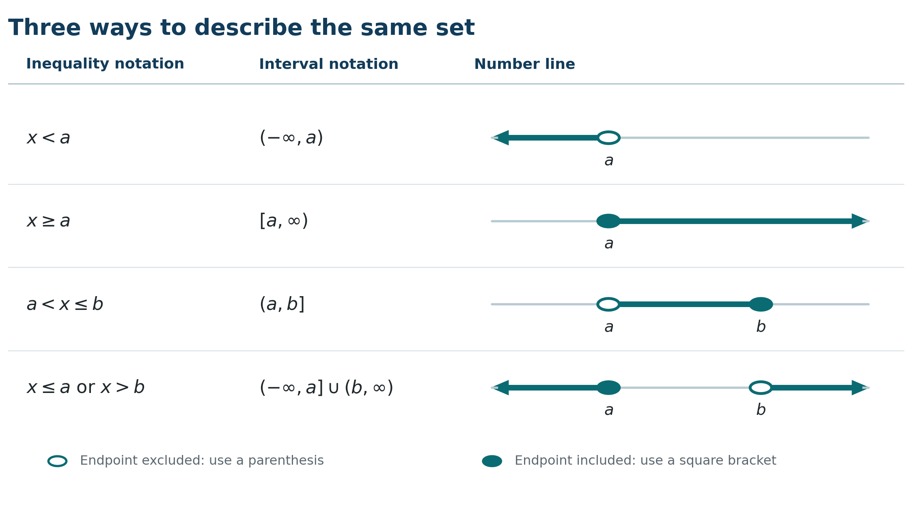
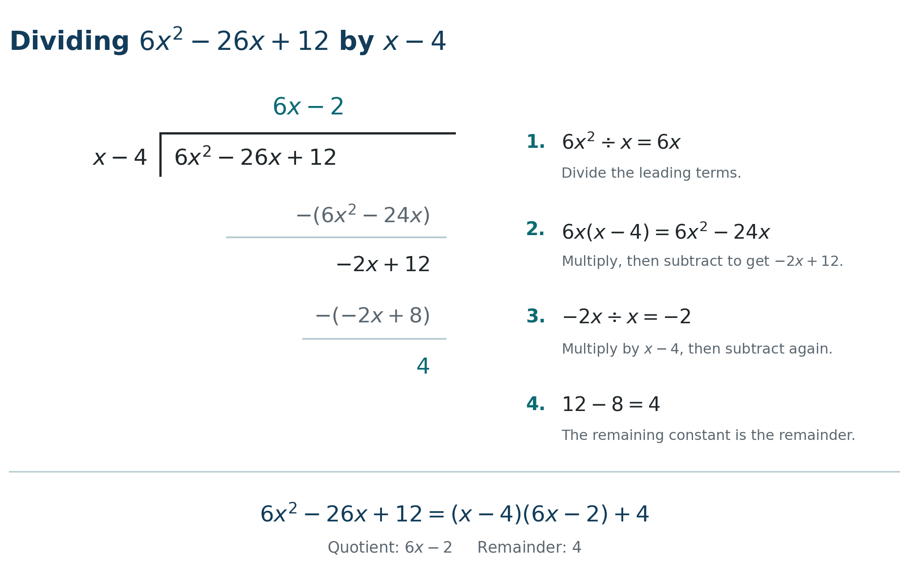
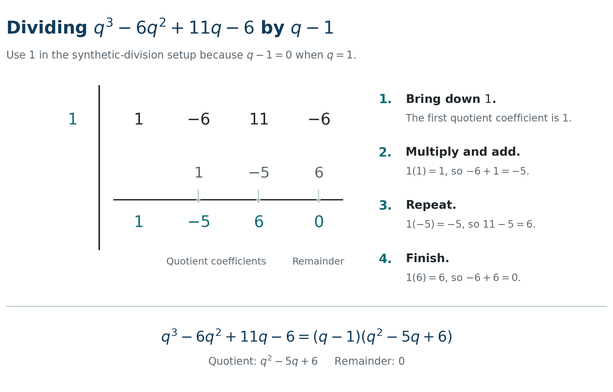

# The Basics {#the-basics}

Water engineering calculations depend on reliable algebra. Flow, storage, concentration, pressure, and treatment problems all require careful work with numbers, expressions, equations, and inequalities. This chapter begins with real numbers and arithmetic, then develops sets, exponents, roots, polynomials, equations, lines, rational expressions, and inequalities. Units and physical restrictions remain part of every calculation. A solution is complete only when its algebra is correct, its units are appropriate, and its meaning is reasonable in context.

::: {.learning-outcomes}
**Learning outcomes.** 

By the end of this chapter, you should be able to:

- apply real-number, fraction, exponent, and root properties;
- represent sets and ranges using inequalities and interval notation;
- simplify, expand, factor, and divide algebraic expressions;
- apply the Remainder, Factor, and Rational Zeros Theorems;
- solve and check linear, quadratic, radical, and formula-based equations;
- determine equations of lines and interpret slope; and
- solve linear, polynomial, rational, and absolute-value inequalities.
:::

## Real numbers and their properties {#real-numbers-properties}

Measurements, counts, calculated values, and model outputs all belong to a common number system.

::: {.definition-box}
**Real number.** A number represented by a point on the real number line. The set of all real numbers is denoted by $\mathbb{R}$.
:::


The numbers used in measurement and calculation are real numbers, denoted by $\mathbb{R}$. They include natural numbers, whole numbers, integers, rational numbers, and irrational numbers. A rational number can be written as $a/b$, where $a$ and $b$ are integers and $b\ne0$. Irrational numbers, including $\sqrt2$ and $\pi$, cannot be written in that form.

::: {.definition-box}
**Rational number.** A number that can be written as $a/b$, where $a$ and $b$ are integers and $b\ne0$.
:::

::: {.worked-example}
[**Worked Example: Classifying a measured value**]{.worked-example-title}

A recorded turbidity reading of 2.75 can be written as $275/100=11/4$. It is therefore rational and real. It is not an integer.
:::

::: {.try-it}
**Try It.** Classify $-6$, $\sqrt7$, and $4/9$ using the smallest applicable number set.

<details class="answer-dropdown"><summary><strong>Check Your Work</strong></summary>$-6$ is an integer, $\sqrt7$ is irrational, and $4/9$ is rational.</details>
:::

For real numbers $a$, $b$, and $c$, addition and multiplication are commutative and associative.

::: {.theorem-box}
**Commutative, associate, and distributive laws.** 

Let $a$, $b$, and $c$ be real numbers.  Then

**Commutative law**
$$a + b = b + a,\qquad a \times b = b \times a,$$

**Associate law**
$$a + (b+c) = (a+b) + c,\qquad a \times (b \times c) = (a \times b) \times c,$$

**Distributive law**
$$a \times (b+c)=a \times b + a \times c,\qquad (b + c) \times a = b \times a + c \times a.$$
:::

::: {.worked-example}
[**Worked Example: Applying the distributive property**]{.worked-example-title}

Simplify $3(8-2y)$:

$$3(8-2y)=24-6y.$$

Every term inside the parentheses is multiplied by 3.
:::

::: {.try-it}
**Try It.** Simplify $-4(2-3x)$.

<details class="answer-dropdown"><summary><strong>Check Your Work</strong></summary>$-8+12x$.</details>
:::


The commutative property changes order, while the associative property changes grouping. Neither property permits arbitrary rearrangement of subtraction or division. For instance, $8-3$ is not equal to $3-8$. The properties of negatives follow from multiplication by $-1$:


::: {.theorem-box}
**Properties of negative numbers.** 

For any real numbers $a$, we have

$$(-1)a=-a,\qquad -(-a)=a,\qquad (-a)(-b)=ab,$$

$$-(a+b)=-a-b,\qquad -(a-b)=-a+b.$$
:::

These identities are especially important when a negative sign appears outside a long formula. A reliable practice is to regard the sign as a factor of $-1$ and distribute it explicitly.


::: {.worked-example}
[**Worked Example: Interpreting a signed water-level change**]{.worked-example-title}

A reservoir level changes by $-0.18$ m in the morning and by $+0.07$ m in the afternoon. The net change is

$$-0.18+0.07=-0.11\ \text{m}.$$

The negative result means that the final level is 0.11 m below the initial level.
:::

::: {.try-it}
**Try It.** A wet well level changes by $-0.24$ m and then by $+0.31$ m. Find and interpret the net change.

<details class="answer-dropdown"><summary><strong>Check Your Work</strong></summary>$-0.24+0.31=0.07$ m, so the final level is 0.07 m above the initial level.</details>
:::


### Translating signs carefully

The negative sign can indicate a negative number, subtraction, or multiplication by $-1$. These meanings are related but should not be blurred. In $-3^2$, the exponent applies before the negative sign, so the value is $-(3^2)=-9$. In $(-3)^2$, the parentheses make $-3$ the base, so the value is 9. Parentheses are therefore essential when a negative value is substituted into a power.

Engineering sign conventions should be stated before calculation. A negative elevation can mean below a chosen datum. A negative change in tank depth can mean that depth decreased. Neither represents a negative physical length. The sign communicates direction relative to a reference.

::: {.worked-example}
[**Worked Example: Evaluating a negative squared correction**]{.worked-example-title}

A calibration calculation contains $-0.4^2$. Because the exponent is evaluated first,

$$-0.4^2=-(0.4^2)=-0.16.$$

If the intended base were $-0.4$, the expression would need to be written $(-0.4)^2=0.16$.
:::

::: {.try-it}
**Try It.** Evaluate $-1.5^2$ and $(-1.5)^2$.

<details class="answer-dropdown"><summary><strong>Check Your Work</strong></summary>$-1.5^2=-2.25$, while $(-1.5)^2=2.25$.</details>
:::


::: {.applied-problem}
**Applied Problem: Tracking a reservoir level.** A reservoir begins the day at 6.42 m relative to its operating datum. Withdrawal lowers the level by 0.38 m, inflow raises it by 0.21 m, and evaporation lowers it by another 0.03 m. Determine the final level and the net change.

<details class="answer-dropdown"><summary><strong>Check Your Work</strong></summary>The final level is $6.42-0.38+0.21-0.03=6.22$ m. The net change is $6.22-6.42=-0.20$ m, so the reservoir finishes 0.20 m below its starting level.</details>
:::

### Practice Problems

1. Simplify $5(3-2x)$.
<details class="answer-dropdown"><summary><strong>Check Your Work</strong></summary>$15-10x$.</details>

2. Name the smallest applicable set for 0.
<details class="answer-dropdown"><summary><strong>Check Your Work</strong></summary>The whole numbers.</details>

3. Is $0.125$ rational? Explain.
<details class="answer-dropdown"><summary><strong>Check Your Work</strong></summary>Yes. $0.125=1/8$.</details>

4. Simplify $-(7-y)$.
<details class="answer-dropdown"><summary><strong>Check Your Work</strong></summary>$-7+y$.</details>

5. A measured flow is 12.4 L/s. Identify the smallest familiar number set containing 12.4.
<details class="answer-dropdown"><summary><strong>Check Your Work</strong></summary>It is rational because $12.4=62/5$.</details>

6. A tank level falls 0.35 m and then rises 0.12 m. Find the net change.
<details class="answer-dropdown"><summary><strong>Check Your Work</strong></summary>$-0.35+0.12=-0.23$ m. The level falls by 0.23 m overall.</details>

7. A pressure correction is written $-(1.8-0.6)$. Simplify it.
<details class="answer-dropdown"><summary><strong>Check Your Work</strong></summary>$-(1.8-0.6)=-1.2$.</details>

8. A flow measurement is $\sqrt{50}$ L/s. Is the exact value rational or irrational?
<details class="answer-dropdown"><summary><strong>Check Your Work</strong></summary>$\sqrt{50}=5\sqrt2$, which is irrational.</details>

## BEDMAS and fractions {#bedmas-fractions}

Reliable calculations require an agreed order for interpreting operations and a consistent way to work with parts of a whole.  BEDMAS records the order of operations: 

- brackets, 
- exponents, 
- division and multiplication from left to right, 
- addition and subtraction from left to right. 


::: {.definition-box}
**Fraction.** A quotient $a/b$ in which $a$ is the numerator, $b$ is the denominator, and $b\ne0$.
:::

Fractions follow the same BEDMAS rules. To multiply fractions, multiply their numerators and denominators. To divide, multiply by the reciprocal. To add or subtract, first use a common denominator.


::: {.theorem-box}

For nonzero denominators,

$$\frac ab\frac cd=\frac{ac}{bd},\qquad
\frac ab\div\frac cd=\frac ab\frac dc,$$

and

$$\frac ab+\frac cb=\frac{a+c}{b}.$$
:::


When denominators differ, use the least common denominator rather than adding denominators. A fraction bar also acts as a grouping symbol. Everything in its numerator is evaluated as one group and everything in its denominator as another. In an engineering calculation, keep several digits during intermediate work and round only the final result to a precision justified by the data.

::: {.worked-example}
[**Worked Example: Comparing two fractional operating periods**]{.worked-example-title}

A pump operates for $3/8$ of an hour at one setting and $5/12$ of an hour at another. The total operating time is

$$\frac38+\frac5{12}=\frac9{24}+\frac{10}{24}=\frac{19}{24}\ \text{h}.$$
:::

::: {.try-it}
**Try It.** A backwash cycle uses $2/15$ h for draining and $1/10$ h for rinsing. Find the combined time.

<details class="answer-dropdown"><summary><strong>Check Your Work</strong></summary>$2/15+1/10=4/30+3/30=7/30$ h, or 14 min.</details>
:::


::: {.worked-example}
[**Worked Example: Combining fractions of capacity**]{.worked-example-title}

If two operating periods process $1/6$ and $4/9$ of a tank capacity, then

$$\frac16+\frac49=\frac3{18}+\frac8{18}=\frac{11}{18}.$$
:::

::: {.try-it}
**Try It.** Combine $1/4$ and $2/3$ of a tank capacity.

<details class="answer-dropdown"><summary><strong>Check Your Work</strong></summary>$1/4+2/3=3/12+8/12=11/12$.</details>
:::

### Complex numerical fractions

A complex fraction has one or more fractions in its numerator or denominator. Simplify the numerator and denominator separately, or multiply both by the least common denominator of all smaller fractions. For example,

$$
\frac{\frac16+\frac49}{\frac24-\frac2{10}}
=\frac{\frac{11}{18}}{\frac3{10}}
=\frac{11}{18}\cdot\frac{10}{3}
=\frac{55}{27}.
$$

The equality at every stage makes the order visible. Entering an entire complex fraction into a calculator without grouping parentheses can produce a different expression.

::: {.worked-example}
<span class="worked-example-title">Worked Example: Simplifying a complex fraction</span>

Simplify

$$
\frac{\dfrac{3}{4}+\dfrac{1}{6}}
     {\dfrac{5}{8}-\dfrac{1}{4}}.
$$

**Approach**

First, add the fractions in the numerator and subtract the fractions in the denominator. Then divide the resulting fractions by multiplying by the reciprocal.

**Worked Solution**

Simplify the numerator:

$$
\frac{3}{4}+\frac{1}{6}
=
\frac{9}{12}+\frac{2}{12}
=
\frac{11}{12}.
$$

Simplify the denominator:

$$
\frac{5}{8}-\frac{1}{4}
=
\frac{5}{8}-\frac{2}{8}
=
\frac{3}{8}.
$$

The original complex fraction becomes

$$
\frac{\dfrac{3}{4}+\dfrac{1}{6}}
     {\dfrac{5}{8}-\dfrac{1}{4}}
=
\frac{\dfrac{11}{12}}{\dfrac{3}{8}}
=
\frac{11}{12}\cdot\frac{8}{3}
=
\frac{22}{9}.
$$

Therefore,

$$
\frac{\dfrac{3}{4}+\dfrac{1}{6}}
     {\dfrac{5}{8}-\dfrac{1}{4}}
=
\frac{22}{9}.
$$

**Interpretation**

The main fraction bar represents division. Once the numerator and denominator have each been simplified, divide by multiplying by the reciprocal of the denominator.
:::

::: {.try-it}
**Try It.** A dimensionless treatment-performance index is calculated using

$$
I=
\frac{\dfrac{5}{6}-\dfrac{1}{4}}
     {\dfrac{2}{3}+\dfrac{1}{9}}.
$$

Simplify the complex fraction and determine the value of $I$.

<details class="answer-dropdown">
<summary><strong>Check Your Work</strong></summary>

Simplify the numerator:

$$
\frac{5}{6}-\frac{1}{4}
=
\frac{10}{12}-\frac{3}{12}
=
\frac{7}{12}.
$$

Simplify the denominator:

$$
\frac{2}{3}+\frac{1}{9}
=
\frac{6}{9}+\frac{1}{9}
=
\frac{7}{9}.
$$

The complex fraction becomes

$$
I
=
\frac{\dfrac{7}{12}}{\dfrac{7}{9}}
=
\frac{7}{12}\cdot\frac{9}{7}
=
\frac{9}{12}
=
\frac{3}{4}.
$$

Therefore, the treatment-performance index is

$$
I=\frac{3}{4}=0.75.
$$

</details>
:::


### Units, conversion factors, and precision

Units may be treated as algebraic factors. A conversion factor is a ratio equal to 1, such as $1000\ \text{L}/1\ \text{m}^3$. Arrange it so the unwanted unit cancels. For example,

$$
2.4\ \text{m}^3\left(\frac{1000\ \text{L}}{1\ \text{m}^3}\right)=2400\ \text{L}.
$$

This cancellation shows why multiplying by 1000 is appropriate. If the units do not cancel as intended, the conversion factor is upside down or the relationship is incomplete. A rate such as litres per minute is a fraction, so multiplying by minutes produces litres.

Exact numbers, such as 1000 L in 1 m³, do not limit precision. Measured values do. Retain guard digits during a calculation and round the final result once. A reported answer should not imply more precision than the measurements support. Estimation provides a quick reasonableness check: a basin roughly 20 m by 8 m by 3 m should have a volume near 480 m³, not 48 m³ or 4800 m³.

::: {.worked-example}
[**Worked Example: Calculating a rectangular basin volume**]{.worked-example-title}

A clearwell is 18.0 m long, 7.5 m wide, and filled to a depth of 3.2 m. Using $V=LWD$,

$$
V = (18.0)(7.5)(3.2) = 432\ \text{m}^3.
$$

The numerical result is 432, and its unit is cubic metres because three lengths were multiplied.
:::

::: {.try-it}
**Try It.** Find the volume of a basin measuring 12 m by 6.5 m by 2.0 m.

<details class="answer-dropdown"><summary><strong>Check Your Work</strong></summary>$V=(12)(6.5)(2.0)=156\ \text{m}^3$.</details>
:::

::: {.worked-example}
[**Worked Example: Converting a daily flow to litres**]{.worked-example-title}

A small facility treats $0.85\ \text{m}^3$ of water per day. Since $1\ \text{m}^3=1000\ \text{L}$,

$$0.85\ \text{m}^3\left(\frac{1000\ \text{L}}{1\ \text{m}^3}\right)=850\ \text{L}.$$
:::

::: {.try-it}
**Try It.** Convert $3.6\ \text{m}^3$ to litres.

<details class="answer-dropdown"><summary><strong>Check Your Work</strong></summary>$3.6(1000)=3600$ L.</details>
:::

::: {.applied-problem}
**Applied Problem: Estimating stored water.** A rectangular equalization basin is 14.0 m long and 6.0 m wide. The water depth is $2\tfrac14$ m. Find the stored volume in cubic metres and litres.

<details class="answer-dropdown"><summary><strong>Check Your Work</strong></summary>Convert $2\tfrac14$ to 2.25. Then $V=(14.0)(6.0)(2.25)=189\ \text{m}^3$. Multiplying by 1000 gives $189{,}000$ L.</details>
:::

### Practice Problems

1. Evaluate $18-3(4+1)$.
<details class="answer-dropdown"><summary><strong>Check Your Work</strong></summary>$18-15=3$.</details>

2. Evaluate $6+2^3(5-2)$.
<details class="answer-dropdown"><summary><strong>Check Your Work</strong></summary>$6+8(3)=30$.</details>

3. Calculate $3/8+5/12$.
<details class="answer-dropdown"><summary><strong>Check Your Work</strong></summary>$9/24+10/24=19/24$.</details>

4. Calculate $(7/10)\div(14/15)$.
<details class="answer-dropdown"><summary><strong>Check Your Work</strong></summary>$(7/10)(15/14)=3/4$.</details>

5. A tank is $9.0$ m by $4.0$ m by $2.5$ m. Find its volume.
<details class="answer-dropdown"><summary><strong>Check Your Work</strong></summary>$V=(9.0)(4.0)(2.5)=90\ \text{m}^3$.</details>

6. A filter is online for $5/12$ of a day and in standby for $1/8$ of a day. What fraction of the day do these periods occupy?
<details class="answer-dropdown"><summary><strong>Check Your Work</strong></summary>$5/12+1/8=10/24+3/24=13/24$ of a day.</details>

7. Convert $4.75\ \text{m}^3$ of water to litres.
<details class="answer-dropdown"><summary><strong>Check Your Work</strong></summary>$4.75(1000)=4750$ L.</details>

8. A chemical feed pump delivers 18 L/min for 35 min. Find the delivered volume.
<details class="answer-dropdown"><summary><strong>Check Your Work</strong></summary>$(18\ \text{L/min})(35\ \text{min})=630$ L.</details>

## Sets, inequalities, and interval notation {#sets-interval-notation}

Operating conditions are often described as collections of permitted values rather than as a single measurement.

::: {.definition-box}
**Set.** A collection of distinct objects called elements.
:::


A set is written with curly braces, as in $A=\{2,4,6\}$. The intersection $A\cap B$ contains elements common to both sets. The union $A\cup B$ contains elements in either set or both.

::: {.definition-box}
**Union and intersection of sets.**

For sets $A$ and $B$, the union of $A$ and $B$ is the set $A \cup B$ and includes any elements in set $A$, in set $B$ or in both.  The intersection of $A$ and $B$ is the set $A \cap B$ and includes any elements that are common to sets $A$ and $B$.
:::


::: {.worked-example}
[**Worked Example: Combining inspection sets**]{.worked-example-title}

If $A=\{1,3,5,7\}$ and $B=\{3,4,5,6\}$, then $A\cap B=\{3,5\}$ and $A\cup B=\{1,3,4,5,6,7\}$.
:::

::: {.try-it}
**Try It.** Find the intersection of $C=\{2,4,6\}$ and $D=\{1,2,3,4\}$.
<details class="answer-dropdown"><summary><strong>Check Your Work</strong></summary>$C\cap D=\{2,4\}$.</details>
:::

Set-builder notation describes sets of real numbers, such as

$$\{x\in\mathbb{R}\mid -3\le x<-1\}.$$

The same set is $[-3,-1)$ in interval notation. A square bracket includes an endpoint. A parenthesis excludes it. Infinity always receives a parenthesis. Brackets are used here because they communicate endpoint inclusion, not because the endpoints are numbers.

::: {.definition-box}
**Interval.** A continuous set of real numbers between specified endpoints.
:::

The order symbols have geometric meaning. If $a$ lies to the left of $b$ on the number line, then $a<b$ and $b>a$. The symbols $\le$ and $\ge$ include equality. Set-builder notation states both the membership rule and, when needed, the number system. Thus $\{x\in\mathbb R\mid x\ge5\}$ and $[5,\infty)$ describe the same real-number set.

Intersections often model simultaneous requirements. If a pump must satisfy both an equipment limit and a process limit, its permitted settings lie in the intersection of the two ranges. Unions model alternatives, where satisfying either range is sufficient. Sketching both sets on one number line is an effective way to verify an interval calculation.


::: {.worked-example}
[**Worked Example: Intersecting two operating limits**]{.worked-example-title}

A pump is rated for $20\le q\le42$ L/s, while a process requires $28\le q\le50$ L/s. Both conditions hold on their intersection:

$$[20,42]\cap[28,50]=[28,42].$$
:::

::: {.try-it}
**Try It.** Find the intersection of $[15,35]$ and $[24,40]$.
<details class="answer-dropdown"><summary><strong>Check Your Work</strong></summary>$[24,35]$.</details>
:::


### Converting among representations

To move from an inequality to a graph, first locate each endpoint, decide whether it is included, and shade the permitted side or region. Use a solid point for an included endpoint and an open point for an excluded endpoint. Interval notation records the same distinction with a square bracket or parenthesis.

For example, $x\ge-3$ begins at $-3$, includes that endpoint, and extends without bound to the right. Its interval is $[-3,\infty)$. The infinity symbol receives a parenthesis because infinity is not a real endpoint. For a bounded condition such as $-4<x\le2.5$, the interval is $(-4,2.5]$.

::: {.worked-example}
[**Worked Example: Recording a flow range**]{.worked-example-title}

A filter may operate from 18 L/s through 26 L/s, including both limits. If $q$ is flow rate, then

$$18\le q\le26.$$

The corresponding interval is $[18,26]$.
:::

::: {.try-it}
**Try It.** Write the range from 12 L/s, excluded, through 20 L/s, included, as an inequality and interval.
<details class="answer-dropdown"><summary><strong>Check Your Work</strong></summary>$12<q\le20$ and $(12,20]$.</details>
:::

```{r inequality-interval-notation-figure, echo=FALSE, fig.align='center', out.width='100%', fig.cap='Connections among inequality notation, interval notation, and number-line representations.'}

```

::: {.worked-example}
[**Worked Example: Converting a chlorine-residual specification**]{.worked-example-title}

A specification requires a residual greater than 0.20 mg/L but no greater than 0.80 mg/L. If $C$ is the residual,

$$0.20<C\le0.80,$$

which is $(0.20,0.80]$ in interval notation.
:::

::: {.try-it}
**Try It.** Express $6.5\le p<8.5$ in interval notation.
<details class="answer-dropdown"><summary><strong>Check Your Work</strong></summary>$[6.5,8.5)$.</details>
:::

::: {.applied-problem}
**Applied Problem: Selecting an allowable filter loading rate.** A filter is mechanically rated from 4 through 12 m/h. Water-quality conditions require a rate greater than 6 m/h but less than 10 m/h. Write each range in interval notation and determine the allowable intersection.

<details class="answer-dropdown"><summary><strong>Check Your Work</strong></summary>The equipment range is $[4,12]$ and the process range is $(6,10)$. Their intersection is $(6,10)$ m/h.</details>
:::

### Practice Problems

1. Write $x\ge-3$ in interval notation.
<details class="answer-dropdown"><summary><strong>Check Your Work</strong></summary>$[-3,\infty)$.</details>
2. Write $(-4,7)$ as an inequality.
<details class="answer-dropdown"><summary><strong>Check Your Work</strong></summary>$-4<x<7$.</details>
3. Find $\{1,2,5\}\cap\{2,3,5\}$.
<details class="answer-dropdown"><summary><strong>Check Your Work</strong></summary>$\{2,5\}$.</details>
4. Find $\{1,2\}\cup\{2,4\}$.
<details class="answer-dropdown"><summary><strong>Check Your Work</strong></summary>$\{1,2,4\}$.</details>
5. A pressure must be below 550 kPa. Express the condition for $p$.
<details class="answer-dropdown"><summary><strong>Check Your Work</strong></summary>$p<550$, or $(-\infty,550)$ algebraically.</details>

6. A tank level must satisfy $2.0\le h\le4.5$ m. Write the interval.
<details class="answer-dropdown"><summary><strong>Check Your Work</strong></summary>$[2.0,4.5]$ m.</details>

7. A pump can provide $[18,44]$ L/s, but a process requires $[25,38]$ L/s. Find the common operating range.
<details class="answer-dropdown"><summary><strong>Check Your Work</strong></summary>$[18,44]\cap[25,38]=[25,38]$ L/s.</details>

8. A turbidity alarm is triggered below 0.1 NTU or above 1.0 NTU. Express the alarm set as a union of intervals.
<details class="answer-dropdown"><summary><strong>Check Your Work</strong></summary>$(-\infty,0.1)\cup(1.0,\infty)$.</details>


## Absolute value and distance {#absolute-value-distance}

Signed measurements describe direction relative to a reference, while many engineering questions require only the magnitude of a difference.

::: {.definition-box}
**Absolute value.** The absolute value of a real number $a$, written $|a|$, is the distance between $a$ and zero on the number line.

More formally,

$$|a|=\begin{cases}a,&a\ge0,\\-a,&a<0.\end{cases}$$
:::

Absolute value measures distance from zero, so $|a|\ge0$. The distance between $a$ and $b$ is

$$d(a,b)=|b-a|.$$

Absolute value is not an instruction to remove a negative sign mechanically. Evaluate the expression inside the bars first, then take its distance from zero. Thus $|3-8|=|-5|=5$. The order inside the bars matters, but the distance between two values does not: $|b-a|=|a-b|$.

For elevations $-2.4$ m and 5.1 m, the distance is

$$|5.1-(-2.4)|=7.5\ \text{m}.$$

::: {.worked-example}
[**Worked Example: Distance between survey readings**]{.worked-example-title}

Two readings relative to a benchmark are $-2.4$ m and 5.1 m. Their distance is

$$d=|5.1-(-2.4)|=7.5\ \text{m}.$$

Distance is positive even though one position is below the benchmark.
:::

::: {.try-it}
**Try It.** Find the distance between $-3.2$ m and 1.9 m.
<details class="answer-dropdown"><summary><strong>Check Your Work</strong></summary>$|1.9-(-3.2)|=5.1$ m.</details>
:::

::: {.theorem-box}
For real numbers $a$ and $b$, we have

$$|ab|=|a||b|, \qquad \qquad  |a/b|=|a|/|b|, \text{ when } b\ne0$$ 
:::

::: {.worked-example}
[**Worked Example: Measuring departure from a pH target**]{.worked-example-title}

A process target is pH 7.20 and the measured value is 6.85. The signed deviation is $6.85-7.20=-0.35$, while the magnitude of the deviation is

$$|6.85-7.20|=0.35.$$
:::

::: {.try-it}
**Try It.** Find the absolute deviation of a pH reading of 7.62 from a target of 7.25.
<details class="answer-dropdown"><summary><strong>Check Your Work</strong></summary>$|7.62-7.25|=0.37$.</details>
:::

::: {.worked-example}
[**Worked Example: Comparing two pipe elevations**]{.worked-example-title}

The invert elevations of two pipe ends are 412.84 m and 410.19 m. Their vertical separation is

$$|410.19-412.84|=2.65\ \text{m}.$$
:::

::: {.try-it}
**Try It.** Find the separation between elevations 506.30 m and 503.75 m.
<details class="answer-dropdown"><summary><strong>Check Your Work</strong></summary>$|503.75-506.30|=2.55$ m.</details>
:::


::: {.theorem-box}
**Triangle inequality**
For real numbers $a$ and $b$, we have
$|a+b|\le|a|+|b|$. 
:::

::: {.worked-example}
<span class="worked-example-title">Worked Example: Applying the triangle inequality</span>

A tank level rises by $0.42$ m and then falls by $0.31$ m. The magnitude of the net change is

$$
|0.42+(-0.31)|=|0.11|=0.11\text{ m}.
$$

The sum of the magnitudes of the individual changes is

$$
|0.42|+|-0.31|=0.42+0.31=0.73\text{ m}.
$$

Therefore,

$$
|0.42+(-0.31)|\leq |0.42|+|-0.31|.
$$

The net change cannot be greater than the total amount of movement.
:::

Absolute value reports magnitude without direction. A signed deviation can show whether a reading is above or below target, while its absolute value shows how far it is from target.


::: {.worked-example}
[**Worked Example: Interpreting a deviation**]{.worked-example-title}

A sensor reads 0.8 units below its reference, so its signed deviation is $-0.8$. The magnitude of the deviation is $|-0.8|=0.8$ units.
:::

::: {.try-it}
**Try It.** A reading differs from its target by $-1.25$ mg/L. Find the magnitude of the difference.
<details class="answer-dropdown"><summary><strong>Check Your Work</strong></summary>$|-1.25|=1.25$ mg/L.</details>
:::


::: {.applied-problem}
**Applied Problem: Checking a chemical-feed tolerance.** A controller is set to deliver 24.0 L/h. During four inspections, the measured rates are 23.4, 24.3, 25.1, and 23.8 L/h. Calculate the absolute deviation from the set point for each reading and identify the largest deviation.

<details class="answer-dropdown"><summary><strong>Check Your Work</strong></summary>The absolute deviations are 0.6, 0.3, 1.1, and 0.2 L/h. The largest deviation is 1.1 L/h, produced by the 25.1 L/h reading.</details>
:::

### Practice Problems

1. Evaluate $|-12|$. <details class="answer-dropdown"><summary><strong>Check Your Work</strong></summary>12.</details>
2. Evaluate $|4-11|$. <details class="answer-dropdown"><summary><strong>Check Your Work</strong></summary>7.</details>
3. Find the distance between $-6$ and 9. <details class="answer-dropdown"><summary><strong>Check Your Work</strong></summary>15.</details>
4. Solve $|x|=5$. <details class="answer-dropdown"><summary><strong>Check Your Work</strong></summary>$x=-5$ or $x=5$.</details>
5. Two elevations are 102.4 m and 98.7 m. Find their separation. <details class="answer-dropdown"><summary><strong>Check Your Work</strong></summary>3.7 m.</details>
6. A chlorine residual is 0.18 mg/L below a 0.75 mg/L target. Find the magnitude of the deviation. <details class="answer-dropdown"><summary><strong>Check Your Work</strong></summary>0.18 mg/L.</details>
7. Find the vertical separation between pipe elevations 284.65 m and 281.90 m. <details class="answer-dropdown"><summary><strong>Check Your Work</strong></summary>$|281.90-284.65|=2.75$ m.</details>
8. A flow reading is 42.6 L/s and its reference value is 45.0 L/s. Find the signed deviation and absolute deviation. <details class="answer-dropdown"><summary><strong>Check Your Work</strong></summary>The signed deviation is $42.6-45.0=-2.4$ L/s, and the absolute deviation is 2.4 L/s.</details>


## Exponents, roots, and rational exponents {#exponents-roots}

Repeated multiplication and its inverse operations provide compact ways to express area, volume, scaling, and scientific notation.

::: {.definition-box}
**Exponent.** A number that indicates the power to which a base is raised.
:::


For example, $$2^5 = 32.$$  The quantity 5 in $2^5$ is the exponent.  

::: {.theorem-box}
For real numbers $a$, $b$, $m$ and $n$, we have

$$a^ma^n=a^{m+n},\qquad \qquad \frac{a^m}{a^n}=a^{m-n},\qquad \qquad (a^m)^n=a^{mn}.$$
:::


::: {.worked-example}
[**Worked Example: Simplifying exponent notation**]{.worked-example-title}

$$\frac{x^7x^{-2}}{x^3}=x^{7-2-3}=x^2,\qquad x\ne0.$$
:::

::: {.try-it}
**Try It.** Simplify $(a^3)^2/a^4$.
<details class="answer-dropdown"><summary><strong>Check Your Work</strong></summary>$a^2$, with $a\ne0$.</details>
:::

Scientific notation expresses a number in the form $a\times10^n$, where $1\leq |a|<10$ and $n$ is an integer. It is especially useful in water engineering for representing very large or very small quantities, such as reservoir volumes, microorganism counts, and trace contaminant concentrations.

::: {.worked-example}
[**Worked Example: Writing a small concentration in scientific notation**]{.worked-example-title}

A concentration of 0.000042 g/L can be written

$$0.000042\ \text{g/L}=4.2\times10^{-5}\ \text{g/L}.$$
:::

::: {.try-it}
**Try It.** Write 0.0000068 g/L in scientific notation.
<details class="answer-dropdown"><summary><strong>Check Your Work</strong></summary>$6.8\times10^{-6}$ g/L.</details>
:::


::: {.theorem-box}
For real numbers $a$, $b$, $m$ and $n$, we have

$$ (ab)^n=a^nb^n,\qquad \qquad \left(\frac ab\right)^n=\frac{a^n}{b^n}.$$

For $a\ne0$, $a^0=1$ and $a^{-n}=1/a^n$.
:::


These rules apply to multiplication and division, not addition. In general, $(a+b)^n\ne a^n+b^n$. Negative exponents do not make a value negative. They indicate reciprocals.


::: {.applied-problem}
**Applied Problem: Scaling storage capacity.** Two geometrically similar tanks have linear scale factor 1.5. If the smaller tank holds 32 m³, use the cubic scale factor to estimate the larger tank's capacity.

<details class="answer-dropdown"><summary><strong>Check Your Work</strong></summary>Volume scales with the cube of the linear factor. The capacity is $32(1.5)^3=32(3.375)=108$ m³.</details>
:::

::: {.definition-box}
**Root.** A value that produces a given number when raised to a specified power.
:::


Rational exponents connect powers and roots:

::: {.definition-box}
For real numbers $a \not = 0$, and $m,n \not = 0$, we have
$$a^{m/n}=\sqrt[n]{a^m}.$$
:::

When $n$ is even, a real principal root requires a nonnegative radicand, and $\sqrt{x^2}=|x|$. To rationalize $5/\sqrt3$, multiply by $\sqrt3/\sqrt3$ to obtain $5\sqrt3/3$.

::: {.worked-example}
[**Worked Example: Rationalizing a denominator**]{.worked-example-title}

$$\frac5{\sqrt3}\cdot\frac{\sqrt3}{\sqrt3}=\frac{5\sqrt3}{3}.$$

Multiplying by $\sqrt3/\sqrt3$ changes the form but not the value.
:::

::: {.try-it}
**Try It.** Rationalize $4/\sqrt5$.
<details class="answer-dropdown"><summary><strong>Check Your Work</strong></summary>$4\sqrt5/5$.</details>
:::

Root properties parallel exponent properties when all expressions are defined.

::: {.theorem-box}
For $a,b \in \mathbb{R}$ and $n \in \mathbb{Z}^+$, we have
$$\sqrt[n]{ab}=\sqrt[n]a\sqrt[n]b,
\qquad \qquad
\sqrt[n]{\frac ab}=\frac{\sqrt[n]a}{\sqrt[n]b}.$$
:::

For odd $n$, $\sqrt[n]{a^n}=a$. For even $n$, $\sqrt[n]{a^n}=|a|$. 


### Simplifying roots

Look for perfect-power factors before approximating a root. For example,

$$\sqrt{72}=\sqrt{36\cdot2}=6\sqrt2.$$

An exact radical form retains full precision and often simplifies later algebra. A decimal approximation may be added when the application requires a numerical measurement. When variables appear under an even root, absolute value may be required. For instance, $\sqrt{49x^2}=7|x|$ for real $x$.


::: {.worked-example}
[**Worked Example: Finding the side of a square settling basin**]{.worked-example-title}

A square basin has surface area 180 m². If its side length is $s$, then $s^2=180$, so

$$s=\sqrt{180}=6\sqrt5\approx13.4\ \text{m}.$$

Only the positive root is meaningful as a length.
:::

::: {.try-it}
**Try It.** Find the positive side length of a square basin with area 98 m².
<details class="answer-dropdown"><summary><strong>Check Your Work</strong></summary>$s=\sqrt{98}=7\sqrt2\approx9.90$ m.</details>
:::

The conjugate method follows the difference-of-squares identity. When a denominator has the form $A+B\sqrt C$, multiply by its conjugate $A-B\sqrt C$.  Their product is $A^2-B^2C$, which contains no square root.  Multiplying $2/(7+\sqrt3)$ by $(7-\sqrt3)/(7-\sqrt3)$ produces denominator $49-3=46$ and numerator $14-2\sqrt3$. The simplified result is $(7-\sqrt3)/23$.


::: {.worked-example}
<span class="worked-example-title">Worked Example: Rationalizing with a conjugate</span>

Rationalize the denominator:

$$
\frac{4}{3+\sqrt{5}}.
$$

The conjugate of $3+\sqrt{5}$ is $3-\sqrt{5}$. Multiply the numerator and denominator by the conjugate:

$$
\frac{4}{3+\sqrt{5}}
\cdot
\frac{3-\sqrt{5}}{3-\sqrt{5}}
=
\frac{4(3-\sqrt{5})}{(3+\sqrt{5})(3-\sqrt{5})}.
$$

Use the difference-of-squares pattern in the denominator:

$$
\frac{4(3-\sqrt{5})}{3^2-(\sqrt{5})^2}
=
\frac{4(3-\sqrt{5})}{9-5}
=
3-\sqrt{5}.
$$

Therefore,

$$
\frac{4}{3+\sqrt{5}}=3-\sqrt{5}.
$$
:::

::: {.try-it}
**Try It.** Rationalize the denominator and simplify:

$$
\frac{5}{\sqrt{6}+1}.
$$

<details class="answer-dropdown">
<summary><strong>Check Your Work</strong></summary>

The conjugate of $\sqrt{6}+1$ is $\sqrt{6}-1$. Therefore,

$$
\frac{5}{\sqrt{6}+1}
\cdot
\frac{\sqrt{6}-1}{\sqrt{6}-1}
=
\frac{5(\sqrt{6}-1)}{(\sqrt{6})^2-1^2}.
$$

Simplify:

$$
\frac{5(\sqrt{6}-1)}{6-1}
=
\frac{5(\sqrt{6}-1)}{5}
=
\sqrt{6}-1.
$$

Therefore,

$$
\frac{5}{\sqrt{6}+1}=\sqrt{6}-1.
$$

</details>
:::


### Practice Problems

1. Simplify $y^4y^3$. <details class="answer-dropdown"><summary><strong>Check Your Work</strong></summary>$y^7$.</details>
2. Rewrite $z^{-3}$ without a negative exponent. <details class="answer-dropdown"><summary><strong>Check Your Work</strong></summary>$1/z^3$, $z\ne0$.</details>
3. Write $\sqrt[3]{x^2}$ with a rational exponent. <details class="answer-dropdown"><summary><strong>Check Your Work</strong></summary>$x^{2/3}$.</details>
4. Simplify $\sqrt{49a^2}$. <details class="answer-dropdown"><summary><strong>Check Your Work</strong></summary>$7|a|$.</details>
5. Rationalize $3/\sqrt2$. <details class="answer-dropdown"><summary><strong>Check Your Work</strong></summary>$3\sqrt2/2$.</details>
6. A bacterial count is $3.4\times10^5$ cells/mL. Write the count in ordinary notation. <details class="answer-dropdown"><summary><strong>Check Your Work</strong></summary>340,000 cells/mL.</details>
7. A square tank cover has area 72 m². Give its exact side length in simplified radical form. <details class="answer-dropdown"><summary><strong>Check Your Work</strong></summary>$\sqrt{72}=6\sqrt2$ m.</details>
8. A cylindrical tank's dimensions are doubled. By what factor does its volume change? <details class="answer-dropdown"><summary><strong>Check Your Work</strong></summary>Volume changes by $2^3=8$, so it is eight times as large.</details>


## Algebraic expressions and polynomials {#algebraic-expressions-polynomials}

Engineering formulas frequently combine several variable terms into a single expression that can be evaluated or simplified.

::: {.definition-box}
**Polynomial.** A finite sum of terms whose variable exponents are nonnegative integers.

A polynomial in $x$ has the form

$$a_nx^n+a_{n-1}x^{n-1}+\cdots+a_1x+a_0,$$

where its exponents are nonnegative integers. 
:::


Polynomials are defined for every real input. Like terms may be combined, and products are expanded using the distributive property. 

::: {.worked-example}
[**Worked Example: Combining polynomial terms**]{.worked-example-title}

$$3x^3-9x-2x^3+4x+1=x^3-5x+1.$$
:::

::: {.try-it}
**Try It.** Simplify $7t^2-3t+2t^2+5t$.
<details class="answer-dropdown"><summary><strong>Check Your Work</strong></summary>$9t^2+2t$.</details>
:::

When multiplying polynomials, every term in one factor multiplies every term in the other. FOIL is a memory aid for two binomials, but the distributive property is the general rule. Organizing products by descending degree helps reveal like terms and makes the result easier to check.

For a channel with width $x+3$ metres and depth $x-1$ metres,

$$A=(x+3)(x-1)=x^2+2x-3,$$

with the physical restriction $x>1$.

::: {.worked-example}
[**Worked Example: Expanding a channel-area expression**]{.worked-example-title}

For width $x+3$ metres and depth $x-1$ metres,

$$A=(x+3)(x-1)=x^2+2x-3.$$

The physical setting also requires $x>1$.
:::

::: {.try-it}
**Try It.** Expand the area of a channel with width $x+4$ and depth $x-2$.
<details class="answer-dropdown"><summary><strong>Check Your Work</strong></summary>$x^2+2x-8$, with $x>2$ physically.</details>
:::

The coefficient of the highest-degree term is the leading coefficient. A constant nonzero polynomial has degree zero. In two variables, the degree of a term is the sum of its exponents, so $4x^2y^3$ has degree 5. Expressions containing variables in denominators, negative variable exponents, or variable square roots are algebraic expressions but are not polynomials.

Domain is determined before algebraic manipulation. 

- Polynomials accept every real input. 
- A denominator cannot be zero. 
- An even root requires a nonnegative radicand. 

These rules will recur when functions are introduced.


::: {.theorem-box}
The special-product identities provide efficient expansion for any real numbers $A$ and $B$:

$$ (A+B)^2=A^2+2AB+B^2,$$

$$ (A-B)^2=A^2-2AB+B^2,$$

$$ (A+B)(A-B)=A^2-B^2.$$
:::


### Polynomials in two variables

The expression $5x^2y-3xy^3+7$ is a polynomial in $x$ and $y$. The term $5x^2y$ has degree 3, the term $-3xy^3$ has degree 4, and the constant has degree 0. The polynomial therefore has degree 4. Like terms must have the same variables raised to the same powers. Thus $3x^2y$ and $-8x^2y$ combine, but $x^2y$ and $xy^2$ do not.

::: {.worked-example}
[**Worked Example: Combining a two-variable flow model**]{.worked-example-title}

Suppose two contributions to a flow model are $4q^2t-3qt^2$ and $-q^2t+5qt^2$. Combining like terms gives

$$(4q^2t-q^2t)+(-3qt^2+5qt^2)=3q^2t+2qt^2.$$
:::

::: {.try-it}
**Try It.** Simplify $(6x^2y-2xy^2)+(3x^2y+5xy^2)$.
<details class="answer-dropdown"><summary><strong>Check Your Work</strong></summary>$9x^2y+3xy^2$.</details>
:::


### Domains of algebraic expressions

An algebraic expression can contain roots, variable denominators, and noninteger powers. Its domain is the set of real inputs for which every operation is defined. For $\sqrt{5-x}/(x+9)$, the square root requires $x\le5$ and the denominator requires $x\ne-9$. Both conditions must hold, so the domain is $(-\infty,-9)\cup(-9,5]$.

For $\sqrt{2-x}/\sqrt{x+3}$, the numerator requires $x\le2$. Because the square root is in the denominator, its radicand must be strictly positive, giving $x>-3$. The combined domain is $(-3,2]$. Writing each restriction separately before taking their intersection makes complicated domains much easier to determine.

Expressions should normally be simplified only after the domain is known. A cancelled factor may remove the visible source of a restriction, but it cannot add a value that was undefined in the original expression.

::: {.worked-example}
[**Worked Example: Determining the domain of a depth formula**]{.worked-example-title}

Consider $D(q)=\sqrt{40-q}/(q-8)$. The square root requires $q\le40$, and the denominator requires $q\ne8$. Therefore,

$$\operatorname{domain}(D)=(-\infty,8)\cup(8,40].$$
:::

::: {.try-it}
**Try It.** Find the domain of $\sqrt{25-x}/(x+5)$.
<details class="answer-dropdown"><summary><strong>Check Your Work</strong></summary>$x\le25$ and $x\ne-5$, so the domain is $(-\infty,-5)\cup(-5,25]$.</details>
:::

::: {.applied-problem}
**Applied Problem: Modelling a trapezoidal channel area.** A channel has bottom width $b$, water depth $d$, and side slopes that add $d/2$ metres of width on each side. Write and expand a polynomial for the cross-sectional area using average width times depth. Then evaluate it at $b=3.0$ m and $d=1.6$ m.

<details class="answer-dropdown"><summary><strong>Check Your Work</strong></summary>The top width is $b+d$, so the average width is $[b+(b+d)]/2=b+d/2$. Thus $A=d(b+d/2)=bd+d^2/2$. At $b=3.0$ and $d=1.6$, $A=(3.0)(1.6)+(1.6)^2/2=6.08$ m².</details>
:::

### Practice Problems

1. State the degree of $4x^5-2x+1$. <details class="answer-dropdown"><summary><strong>Check Your Work</strong></summary>5.</details>
2. Simplify $5x^2+3x-2x^2+x$. <details class="answer-dropdown"><summary><strong>Check Your Work</strong></summary>$3x^2+4x$.</details>
3. Expand $(x+2)(x+5)$. <details class="answer-dropdown"><summary><strong>Check Your Work</strong></summary>$x^2+7x+10$.</details>
4. Expand $(2x-3)^2$. <details class="answer-dropdown"><summary><strong>Check Your Work</strong></summary>$4x^2-12x+9$.</details>
5. State the physical domain for area $A=x(x-1)$ when both dimensions are lengths. <details class="answer-dropdown"><summary><strong>Check Your Work</strong></summary>$x>1$.</details>
6. A rectangular channel has width $d+4$ and depth $d$. Expand its area formula. <details class="answer-dropdown"><summary><strong>Check Your Work</strong></summary>$A=d(d+4)=d^2+4d$.</details>
7. Simplify the combined flow-model terms $7q^2t-2qt^2-3q^2t+6qt^2$. <details class="answer-dropdown"><summary><strong>Check Your Work</strong></summary>$4q^2t+4qt^2$.</details>
8. Find the physical domain of $C(v)=\sqrt{60-v}/(v-10)$ when $v$ is nonnegative. <details class="answer-dropdown"><summary><strong>Check Your Work</strong></summary>$0\le v\le60$ with $v\ne10$, or $[0,10)\cup(10,60]$.</details>

## Expanding and factoring {#expanding-factoring}

The form of an expression affects which features are easy to see and which operations are easy to perform.

::: {.definition-box}
**Factor.** An expression multiplied by another expression to produce a given product.
:::

Factoring reverses expansion. Begin with the greatest factor $A^2 - B^2$, then look for patterns such as

$$A^2-B^2=(A+B)(A-B).$$

::: {.worked-example}
[**Worked Example: Using a difference of squares**]{.worked-example-title}

$$25x^2-9=(5x)^2-3^2=(5x-3)(5x+3).$$
:::

::: {.try-it}
**Try It.** Factor $16y^2-49$.
<details class="answer-dropdown"><summary><strong>Check Your Work</strong></summary>$(4y-7)(4y+7)$.</details>
:::

Always check a factorization by multiplying the factors. A complete factorization removes the greatest common factor first and continues until none of the remaining factors can be factored over the number system in use. The perfect-square patterns are

$$A^2+2AB+B^2=(A+B)^2,$$

$$A^2-2AB+B^2=(A-B)^2.$$

The sum and difference of cubes are

$$A^3+B^3=(A+B)(A^2-AB+B^2),$$

$$A^3-B^3=(A-B)(A^2+AB+B^2).$$

Expressions containing negative or fractional powers can also be factored by removing the lowest power common to every term. This technique is useful later when simplifying derivatives and rate equations, even though those expressions are not polynomials.

### A factoring decision process

First remove the greatest common factor. Next count the terms. Two terms may form a difference of squares or a sum or difference of cubes. Three terms may form a quadratic trinomial or perfect-square trinomial. Four terms may factor by grouping. After each step, inspect every resulting factor again.

For $-7x^4y^2+14xy^3+21xy^4$, the greatest common factor is $-7xy^2$. Factoring it out gives

$$-7xy^2(x^3-2y-3y^2).$$

Choosing a negative greatest common factor makes the leading term inside the parentheses positive. Expanding the result verifies the signs.

::: {.worked-example}
[**Worked Example: Removing a common flow factor**]{.worked-example-title}

Factor $12q^3-18q^2$. The greatest common factor is $6q^2$:

$$12q^3-18q^2=6q^2(2q-3).$$
:::

::: {.try-it}
**Try It.** Factor $15r^3+10r^2$ completely.
<details class="answer-dropdown"><summary><strong>Check Your Work</strong></summary>$5r^2(3r+2)$.</details>
:::

For a trinomial with leading coefficient 1, such as $x^2+9x-22$, find two numbers with product $-22$ and sum 9. The values 11 and $-2$ give $(x+11)(x-2)$. When the leading coefficient is not 1, the split-middle-term method avoids unsupported guessing. In $4x^2-8x-21$, the required product is $-84$ and the required sum is $-8$. The pair 6 and $-14$ leads to

$$
4x^2+6x-14x-21=2x(2x+3)-7(2x+3)=(2x-7)(2x+3).
$$

The factorization is confirmed by expansion. This last step is short and detects most sign or coefficient errors.

To factor $ax^2+bx+c$, find two numbers whose product is $ac$ and whose sum is $b$, split the middle term, and group. For example,

$$6x^2+7x+2=(3x+2)(2x+1).$$

::: {.worked-example}
[**Worked Example: Factoring by grouping**]{.worked-example-title}

For $6x^2+7x+2$, the product $ac$ is 12. The values 3 and 4 multiply to 12 and add to 7:

$$6x^2+3x+4x+2=3x(2x+1)+2(2x+1)=(3x+2)(2x+1).$$
:::

::: {.try-it}
**Try It.** Factor $x^2+9x+20$.
<details class="answer-dropdown"><summary><strong>Check Your Work</strong></summary>$(x+4)(x+5)$.</details>
:::


::: {.worked-example}
[**Worked Example: Factoring a rectangular-area model**]{.worked-example-title}

An expanded basin-area model is $A=w^2+9w+20$. Factoring gives

$$A=(w+4)(w+5).$$

The factors recover the two dimensions represented by the model.
:::

::: {.try-it}
**Try It.** Factor the area model $d^2+11d+24$.
<details class="answer-dropdown"><summary><strong>Check Your Work</strong></summary>$(d+3)(d+8)$.</details>
:::

::: {.applied-problem}
**Applied Problem: Recovering basin dimensions.** A rectangular basin has width $x+2$ m and length $x+7$ m. Its expanded area model is $x^2+9x+14$. Factor the polynomial to verify the dimensions, then find the area when $x=5$.

<details class="answer-dropdown"><summary><strong>Check Your Work</strong></summary>$x^2+9x+14=(x+2)(x+7)$. At $x=5$, the dimensions are 7 m and 12 m, so the area is 84 m².</details>
:::

### Practice Problems

1. Factor $3x^2-6x$. <details class="answer-dropdown"><summary><strong>Check Your Work</strong></summary>$3x(x-2)$.</details>
2. Factor $x^2-11x+24$. <details class="answer-dropdown"><summary><strong>Check Your Work</strong></summary>$(x-3)(x-8)$.</details>
3. Factor $6x^2+5x-4$. <details class="answer-dropdown"><summary><strong>Check Your Work</strong></summary>$(3x+4)(2x-1)$.</details>
4. Factor $9a^2-25$. <details class="answer-dropdown"><summary><strong>Check Your Work</strong></summary>$(3a-5)(3a+5)$.</details>
5. Factor $8x^3-1$. <details class="answer-dropdown"><summary><strong>Check Your Work</strong></summary>$(2x-1)(4x^2+2x+1)$.</details>
6. Factor the pump-expression $18q^2-30q$. <details class="answer-dropdown"><summary><strong>Check Your Work</strong></summary>$6q(3q-5)$.</details>
7. Factor the basin-area model $w^2+13w+40$. <details class="answer-dropdown"><summary><strong>Check Your Work</strong></summary>$(w+5)(w+8)$.</details>
8. Factor the difference between two squared pipe diameters, $D^2-0.36$. <details class="answer-dropdown"><summary><strong>Check Your Work</strong></summary>$(D-0.6)(D+0.6)$.</details>


## Polynomial division and rational zeros {#polynomial-division-zeros}

Higher-degree polynomials require systematic methods for division and for identifying values that make them equal to zero.

::: {.definition-box}
**Zero of a polynomial.** A value $c$ for which $P(c)=0$.
:::

::: {.theorem-box}
**Division Algorithm for Polynomials.** For polynomials $P$ and nonzero $D$, there are unique polynomials $Q$ and $R$ such that

$$P(x)=D(x)Q(x)+R(x),$$

where $R(x)=0$ or the degree of $R$ is less than the degree of $D$.
:::

### Long and synthetic division

To divide $6x^2-26x+12$ by $x-4$, divide leading terms, multiply, subtract, and continue. 



The result is

$$6x^2-26x+12=(x-4)(6x-2)+4.$$

The quotient is $6x-2$ and the remainder is 4. Substitution confirms the remainder because $P(4)=4$. 

::: {.theorem-box}
**Remainder Theorem.** If a polynomial $P(x)$ is divided by $x-c$, the remainder is $P(c)$.
:::


::: {.worked-example}
[**Worked Example: Applying the Remainder Theorem**]{.worked-example-title}

For $P(x)=3x^2-2x+5$, the remainder after division by $x-2$ is

$$P(2)=3(2)^2-2(2)+5=13.$$
:::

::: {.try-it}
**Try It.** Find the remainder when $P(x)=x^3+4x-1$ is divided by $x+1$.
<details class="answer-dropdown"><summary><strong>Check Your Work</strong></summary>$P(-1)=-1-4-1=-6$, so the remainder is $-6$.</details>
:::


::: {.worked-example}
[**Worked Example: Finding a remainder by substitution**]{.worked-example-title}

For $P(x)=2x^3-x+4$, division by $x+1$ has remainder
$$P(-1)=2(-1)^3-(-1)+4=3.$$
:::

::: {.try-it}
**Try It.** Find the remainder when $x^3+2x-5$ is divided by $x-2$.
<details class="answer-dropdown"><summary><strong>Check Your Work</strong></summary>$P(2)=8+4-5=7$.</details>
:::


In synthetic division, include a zero coefficient for every missing power. For $2x^3-7x^2+5$, use coefficients $2,-7,0,5$. Omitting the zero shifts later coefficients into incorrect positions.

::: {.worked-example}
[**Worked Example: Dividing a calibration polynomial**]{.worked-example-title}

Divide $q^3-6q^2+11q-6$ by $q-1$. Synthetic division with $1$ gives quotient $q^2-5q+6$ and remainder 0:

$$q^3-6q^2+11q-6=(q-1)(q^2-5q+6).$$


:::

::: {.try-it}
**Try It.** Divide $x^3-5x^2+6x$ by $x-2$.
<details class="answer-dropdown"><summary><strong>Check Your Work</strong></summary>The quotient is $x^2-3x$ and the remainder is 0.</details>
:::


The division algorithm tells us that $$P(x) = D(x)Q(x) + R(x).$$  If $P(x)$ is divisible by $D(x) = x-c$, then $\frac{P(x)}{x-c} = Q(x)$ and $\frac{R(x)}{D(x)} = 0$ meaning that $R(x) = 0$.  The factor theorem says that if $P(x)$ is divided by $D(x) = x-c$, that the remainder is $P(c) = R(c) = 0$.  Thus, if $P(x)$ is divisible by $x-c$, then $P(c) = 0$.

::: {.theorem-box}
**Factor Theorem.** The expression $x-c$ is a factor of $P(x)$ if and only if $P(c)=0$.
:::


::: {.worked-example}
[**Worked Example: Testing a proposed factor**]{.worked-example-title}

For $P(x)=x^3-4x^2+x+6$,

$$P(2)=8-16+2+6=0.$$

Therefore, $x-2$ is a factor.
:::

::: {.try-it}
**Try It.** Determine whether $x+1$ is a factor of $x^3+2x^2-x-2$.
<details class="answer-dropdown"><summary><strong>Check Your Work</strong></summary>$P(-1)=-1+2+1-2=0$, so $x+1$ is a factor.</details>
:::


### Finding all rational zeros


The Factor Theorem gives us a way to find a factor of a polynomial if we know the zeros of a polynomial.  How do we get a list of possible zeros of the polynomial?


::: {.theorem-box}
**Rational Zeros Theorem.** If $P(x)=a_nx^n+\cdots+a_1x+a_0$ has integer coefficients and $p/q$ is a rational zero in lowest terms, then $p$ is a factor of $a_0$ and $q$ is a factor of $a_n$.
:::


To use the Rational Zeros Theorem to find roots of a polynomial, create the full candidate list, test candidates until one gives remainder zero, divide out the confirmed factor, and repeat. Finish when the remaining quotient is quadratic or factors directly. Finally, multiply the factors to confirm the original polynomial.

For $2x^4+3x^3-12x^2-7x+6$, the Rational Zeros Theorem limits the search to ratios formed from factors of 6 in the numerator and factors of 2 in the denominator. This list is (including repeated fractions): 
$$\text{Denominators of 1:   } \qquad \pm \frac{6}{1}, \pm \frac{3}{1}, \pm \frac{2}{1}, \pm \frac{1}{1},$$
$$\text{Denominators of 2:   } \qquad \pm \frac{6}{2}, \pm \frac{3}{2}, \pm \frac{2}{2}, \pm \frac{1}{2},$$
Testing a candidate with synthetic division both checks the zero and produces a lower-degree quotient. Repeating the process turns a fourth-degree factorization into smaller problems. The final factors should be multiplied to verify the coefficients.

A zero, a factor, and an intercept express related facts. If $P(c)=0$, then $c$ is a zero, $x-c$ is a factor, and $(c,0)$ is an $x$-intercept of the graph.

::: {.worked-example}
[**Worked Example: Factoring with the Factor Theorem**]{.worked-example-title}

For $P(x)=x^3-7x+6$, $P(1)=0$, so $x-1$ is a factor. Division and further factoring give

$$P(x)=(x-1)(x+3)(x-2).$$

The zeros are $-3$, 1, and 2.
:::

::: {.try-it}
**Try It.** Show that $x-2$ is a factor of $x^3-4x^2+x+6$.
<details class="answer-dropdown"><summary><strong>Check Your Work</strong></summary>$P(2)=8-16+2+6=0$, so the Factor Theorem confirms it.</details>
:::

::: {.worked-example}
[**Worked Example: Finding all rational zeros of a cubic**]{.worked-example-title}

For $P(x)=x^3-2x^2-5x+6$, testing the rational candidates shows $P(1)=0$. Dividing by $x-1$ gives $x^2-x-6=(x-3)(x+2)$. Therefore,

$$P(x)=(x-1)(x-3)(x+2),$$

and the rational zeros are $-2$, 1, and 3.
:::

::: {.try-it}
**Try It.** Factor $x^3-x^2-4x+4$ and list its zeros.
<details class="answer-dropdown"><summary><strong>Check Your Work</strong></summary>Grouping gives $(x-1)(x^2-4)=(x-1)(x-2)(x+2)$. The zeros are $-2$, 1, and 2.</details>
:::

::: {.applied-problem}
**Applied Problem: Checking a polynomial sensor model.** A dimensionless sensor correction is modelled by $P(x)=x^3-4x^2+x+6$. Determine whether settings $x=-1$, $x=2$, and $x=3$ make the correction zero. Use the results to factor $P(x)$ completely.

<details class="answer-dropdown"><summary><strong>Check Your Work</strong></summary>$P(-1)=0$, $P(2)=0$, and $P(3)=0$, so all three settings are zeros. The factorization is $P(x)=(x+1)(x-2)(x-3)$.</details>
:::

### Practice Problems

1. Find the remainder when $x^2+3x+1$ is divided by $x-1$. <details class="answer-dropdown"><summary><strong>Check Your Work</strong></summary>$P(1)=5$.</details>
2. Is $x+2$ a factor of $x^3+3x^2-4$? <details class="answer-dropdown"><summary><strong>Check Your Work</strong></summary>Yes, because $P(-2)=0$.</details>
3. List possible rational zeros of $2x^2-5x+2$. <details class="answer-dropdown"><summary><strong>Check Your Work</strong></summary>$\pm1,\pm2,\pm1/2$.</details>
4. Factor $x^3-4x^2-x+4$. <details class="answer-dropdown"><summary><strong>Check Your Work</strong></summary>$(x-4)(x-1)(x+1)$.</details>
5. Divide $x^2-5x+6$ by $x-2$. <details class="answer-dropdown"><summary><strong>Check Your Work</strong></summary>Quotient $x-3$, remainder 0.</details>
6. For a calibration polynomial $P(q)=q^3-4q+3$, find the remainder after division by $q-1$. <details class="answer-dropdown"><summary><strong>Check Your Work</strong></summary>$P(1)=1-4+3=0$, so the remainder is 0.</details>
7. Determine whether $q-3$ is a factor of $P(q)=q^3-5q^2+3q+9$. <details class="answer-dropdown"><summary><strong>Check Your Work</strong></summary>$P(3)=27-45+9+9=0$, so $q-3$ is a factor.</details>
8. A process model is $P(x)=x^3-6x^2+11x-6$. Factor it and list the settings that make $P(x)=0$. <details class="answer-dropdown"><summary><strong>Check Your Work</strong></summary>$P(x)=(x-1)(x-2)(x-3)$, so the settings are 1, 2, and 3.</details>


## Equations and an initial look at inequalities {#equations-initial-inequalities}

Quantitative problems often state that two expressions represent the same quantity and ask which input makes that statement true.

::: {.definition-box}
**Equation.** A statement that two expressions have equal values.
:::

An equation states that two expressions are equal. Solving means finding every value that makes the original equation true. Whatever operation is applied to one side must also be applied to the other. A solution is checked by substituting it into the original statement. If simplification produces an identity such as $0=0$, all values in the original domain solve the equation. If it produces a contradiction such as $0=5,$ there is no solution.

Linear equations are solved by collecting variable terms on one side and constants on the other. Fractions may be cleared by multiplying every term by the least common denominator. Any values excluded by an original variable denominator remain excluded. The same balancing principle applies to inequalities, except that multiplication or division by a negative number reverses the comparison.

### Checking and classifying results

Check a proposed solution by substituting it into both sides of the original statement. An identity such as $0=0$ means that every value in the original domain solves the equation. A contradiction such as $0=5$ means that no value solves it. For equations with variable denominators, state restrictions before clearing fractions because multiplication can conceal a forbidden input.

For $2x-7=3x+2$, subtracting $2x$ and then 2 gives $x=-9$. Substitution confirms that both sides equal $-25$.

::: {.worked-example}
[**Worked Example: Solving and checking an equation**]{.worked-example-title}

Solve $2x-7=3x+2$. Subtracting $2x$ and then 2 gives $x=-9$. The check is

$$2(-9)-7=-25\quad\text{and}\quad3(-9)+2=-25.$$
:::

::: {.try-it}
**Try It.** Solve and check $5x+3=2x+18$.
<details class="answer-dropdown"><summary><strong>Check Your Work</strong></summary>$3x=15$, so $x=5$. Both sides equal 28.</details>
:::

::: {.worked-example}
[**Worked Example: Finding a chemical-feed setting**]{.worked-example-title}

A feed system delivers 18 L before a variable operating period and then adds 6 L for each hour $t$. If the required total is 54 L,

$$18+6t=54,$$

so $6t=36$ and $t=6$ h. Substitution gives $18+6(6)=54$ L.
:::

::: {.try-it}
**Try It.** Solve $25+8t=73$ and interpret $t$ as hours.
<details class="answer-dropdown"><summary><strong>Check Your Work</strong></summary>$8t=48$, so $t=6$ h.</details>
:::

::: {.applied-problem}
**Applied Problem: Scheduling tank filling.** A tank already contains 12,500 L. Water enters at 850 L/min while 150 L/min leaves through a drain. How many minutes are required for the tank to contain 30,000 L?

<details class="answer-dropdown"><summary><strong>Check Your Work</strong></summary>The net inflow is $850-150=700$ L/min. Solve $12{,}500+700t=30{,}000$. Then $700t=17{,}500$, so $t=25$ min.</details>
:::


::: {.worked-example}
[**Worked Example: Reversing an inequality**]{.worked-example-title}

Solve $-3x+6>15$. Subtract 6 to obtain $-3x>9$. Dividing by $-3$ reverses the symbol, so $x<-3$.
:::

::: {.try-it}
**Try It.** Solve $-4x+1\le13$.
<details class="answer-dropdown"><summary><strong>Check Your Work</strong></summary>$-4x\le12$, so $x\ge-3$.</details>
:::

::: {.worked-example}
[**Worked Example: Clearing fractions in a detention-time equation**]{.worked-example-title}

Solve $t/3+t/6=10$. Multiplying every term by 6 gives

$$2t+t=60,$$

so $3t=60$ and $t=20$ min. The original left side is $20/3+20/6=10$.
:::

::: {.try-it}
**Try It.** Solve $q/4+q/12=16$.
<details class="answer-dropdown"><summary><strong>Check Your Work</strong></summary>Multiplying by 12 gives $3q+q=192$, so $q=48$.</details>
:::

### Practice Problems

1. Solve $4x-7=13$. <details class="answer-dropdown"><summary><strong>Check Your Work</strong></summary>$x=5$.</details>
2. Solve $3(x-2)=15$. <details class="answer-dropdown"><summary><strong>Check Your Work</strong></summary>$x=7$.</details>
3. Determine whether $x=4$ solves $2x+1=9$. <details class="answer-dropdown"><summary><strong>Check Your Work</strong></summary>Yes.</details>
4. Solve $2x+5<11$. <details class="answer-dropdown"><summary><strong>Check Your Work</strong></summary>$x<3$.</details>
5. Solve $-5x\ge20$. <details class="answer-dropdown"><summary><strong>Check Your Work</strong></summary>$x\le-4$.</details>
6. A tank contains 8,000 L and fills at 600 L/min. Solve $8000+600t=20{,}000$ for the filling time. <details class="answer-dropdown"><summary><strong>Check Your Work</strong></summary>$600t=12{,}000$, so $t=20$ min.</details>
7. A dosing system must deliver at least 90 L. It has delivered 30 L and continues at 12 L/min. Solve $30+12t\ge90$. <details class="answer-dropdown"><summary><strong>Check Your Work</strong></summary>$12t\ge60$, so $t\ge5$ min.</details>
8. A process equation is $q/5+q/10=18$. Find $q$. <details class="answer-dropdown"><summary><strong>Check Your Work</strong></summary>Multiplying by 10 gives $2q+q=180$, so $q=60$.</details>

## Lines and linear applications {#lines-linear-applications}

When one quantity changes at a constant rate relative to another, a line provides the natural mathematical model.

::: {.definition-box}
**Slope.** The vertical change divided by the horizontal change between two points on a nonvertical line.

The slope through $(x_1,y_1)$ and $(x_2,y_2)$ is

$$m=\frac{y_2-y_1}{x_2-x_1}.$$
:::


Useful line forms are point-slope form $$y-y_1=m(x-x_1)$$, slope-intercept form $$y=mx+b$$, and general form $$Ax+By+C=0$$. Point-slope form is convenient when a point and slope are known. Slope-intercept form displays the constant rate of change and vertical intercept. In general form, set $x=0$ to find the vertical intercept and $y=0$ to find the horizontal intercept.

Vertical lines have undefined slope, horizontal lines have slope zero, parallel lines have equal slopes, and perpendicular nonvertical lines have slopes whose product is $-1$. Slope has units. If volume is plotted against time, slope is a volume-per-time rate. Its sign indicates whether the response increases or decreases as the input increases.


### Intercepts and related lines

The $y$-intercept is found by setting $x=0$, and the $x$-intercept is found by setting $y=0$. For $y=5x-7$, the intercepts are $(0,-7)$ and $(7/5,0)$. 


::: {.worked-example}
[**Worked Example: Finding intercepts**]{.worked-example-title}

For $y=5x-7$, setting $x=0$ gives the $y$-intercept $(0,-7)$. Setting $y=0$ gives $5x-7=0$, so the $x$-intercept is $(7/5,0)$.
:::

::: {.try-it}
**Try It.** Find both intercepts of $y=3x+6$.
<details class="answer-dropdown"><summary><strong>Check Your Work</strong></summary>The intercepts are $(0,6)$ and $(-2,0)$.</details>
:::

Two distinct nonvertical lines are parallel when their slopes are equal. Two nonvertical lines are perpendicular when their slopes are negative reciprocals. A horizontal and a vertical line are also perpendicular.

A linear model assumes constant change. Its slope must be interpreted with units and within the interval where that assumption is reasonable. Extrapolation far beyond observed values may predict impossible negative populations, volumes, or concentrations, which signals that the linear model should no longer be used.


::: {.worked-example}
[**Worked Example: Modelling tank volume over time**]{.worked-example-title}

A tank begins with 4.0 m³ and fills at 0.35 m³/min. Its volume after $t$ minutes is

$$V=0.35t+4.0.$$

The slope is the inflow rate, and the vertical intercept is the initial volume.
:::

::: {.try-it}
**Try It.** Write a linear model for a tank beginning at 7 m³ and draining at 0.25 m³/min.
<details class="answer-dropdown"><summary><strong>Check Your Work</strong></summary>$V=-0.25t+7$.</details>
:::


::: {.worked-example}
[**Worked Example: Temperature conversion**]{.worked-example-title}

Water freezes at $(0,32)$ and boils at $(100,212)$ in Celsius-Fahrenheit coordinates. Thus

$$m=\frac{212-32}{100-0}=\frac95,$$

and the conversion equation is

$$F=\frac95C+32.$$
:::

::: {.try-it}
**Try It.** Use the conversion equation to find the Fahrenheit temperature at $C=20$.
<details class="answer-dropdown"><summary><strong>Check Your Work</strong></summary>$F=(9/5)(20)+32=68^\circ\text{F}$.</details>
:::

::: {.worked-example}
[**Worked Example: A linear calibration**]{.worked-example-title}

A sensor gives outputs 2.0 V at 10 mg/L and 5.0 V at 40 mg/L. The slope is $(5-2)/(40-10)=0.1$ V per mg/L. Using the first point gives $V=0.1C+1$.
:::

::: {.try-it}
**Try It.** Find the output predicted at 25 mg/L.
<details class="answer-dropdown"><summary><strong>Check Your Work</strong></summary>$V=0.1(25)+1=3.5$ V.</details>
:::

::: {.worked-example}
[**Worked Example: Determining a sensor equation from two readings**]{.worked-example-title}

A turbidity sensor produces 1.4 V at 0.5 NTU and 3.8 V at 2.5 NTU. The slope is

$$m=\frac{3.8-1.4}{2.5-0.5}=1.2\ \text{V/NTU}.$$

Using $(0.5,1.4)$ gives $V-1.4=1.2(T-0.5)$, or $V=1.2T+0.8$.
:::

::: {.try-it}
**Try It.** A sensor reads 2 V at 10 L/s and 6 V at 30 L/s. Find its linear equation.
<details class="answer-dropdown"><summary><strong>Check Your Work</strong></summary>The slope is $(6-2)/(30-10)=0.2$ V per L/s. Using either point gives $V=0.2q$.</details>
:::

::: {.applied-problem}
**Applied Problem: Interpreting a declining reservoir model.** During a controlled drawdown, reservoir volume is modelled by $V=-1.8t+72$, where $V$ is in megalitres and $t$ is in hours. Interpret the slope and intercept, find the volume after 15 h, and determine when the model predicts an empty reservoir.

<details class="answer-dropdown"><summary><strong>Check Your Work</strong></summary>The intercept 72 ML is the initial volume. The slope $-1.8$ ML/h is the net loss rate. At 15 h, $V=-1.8(15)+72=45$ ML. Setting $V=0$ gives $t=40$ h.</details>
:::


To compare two lines, rewrite each equation in slope-intercept form unless it is vertical. Equal slopes identify parallel lines. Slopes with product $-1$ identify perpendicular lines. A line through a specified point and parallel to a known line uses the known slope; a perpendicular line uses its negative reciprocal.


### Practice Problems

1. Find the slope through $(1,2)$ and $(5,10)$. <details class="answer-dropdown"><summary><strong>Check Your Work</strong></summary>$m=2$.</details>
2. Find the line with slope 3 through $(2,1)$. <details class="answer-dropdown"><summary><strong>Check Your Work</strong></summary>$y=3x-5$.</details>
3. Find both intercepts of $y=4x-8$. <details class="answer-dropdown"><summary><strong>Check Your Work</strong></summary>$(0,-8)$ and $(2,0)$.</details>
4. Is $y=2x+1$ parallel to $2y=4x-7$? <details class="answer-dropdown"><summary><strong>Check Your Work</strong></summary>Yes. Both slopes are 2.</details>
5. Find a line perpendicular to $y=(1/2)x+3$ through the origin. <details class="answer-dropdown"><summary><strong>Check Your Work</strong></summary>$y=-2x$.</details>
6. A tank contains 12 m³ initially and fills at 0.6 m³/min. Write its volume model and find the volume after 20 min. <details class="answer-dropdown"><summary><strong>Check Your Work</strong></summary>$V=0.6t+12$; $V(20)=24$ m³.</details>
7. Flow rises from 18 L/s at 2 min to 30 L/s at 8 min. Find the slope and interpret it. <details class="answer-dropdown"><summary><strong>Check Your Work</strong></summary>$m=(30-18)/(8-2)=2$ L/s per min. Flow increases by 2 L/s each minute.</details>
8. A linear chlorine-sensor model passes through $(0.2,1.1)$ and $(0.8,2.9)$, where the input is mg/L and output is volts. Find the model. <details class="answer-dropdown"><summary><strong>Check Your Work</strong></summary>$m=(2.9-1.1)/(0.8-0.2)=3$. Using the first point gives $V=3C+0.5$.</details>

## Fractional and rational expressions {#fractional-rational-expressions}

Many water-engineering rates and formulas compare one algebraic quantity with another through division.

::: {.definition-box}
**Fractional expression.** A quotient of two algebraic expressions, with all values that make the denominator zero excluded.
:::

::: {.definition-box}
**Rational expression.** A fractional expression whose numerator and denominator are polynomials.
:::

A fractional expression is a quotient of algebraic expressions. It is rational when its numerator and denominator are polynomials. Its domain excludes values that make an original denominator zero. State restrictions before cancelling factors:

$$\frac{x^2-16}{x-4}=x+4,\qquad x\ne4.$$


::: {.worked-example}
[**Worked Example: Simplifying while retaining the domain**]{.worked-example-title}

For $(x^2-16)/(x-4)$, the original denominator requires $x\ne4$. Factoring and cancelling gives

$$\frac{(x-4)(x+4)}{x-4}=x+4,\qquad x\ne4.$$

The restriction remains because the original expression is undefined at 4.
:::

::: {.try-it}
**Try It.** Simplify $(x^2-25)/(x-5)$ and state the restriction.
<details class="answer-dropdown"><summary><strong>Check Your Work</strong></summary>$x+5$, with $x\ne5$.</details>
:::


Four domain patterns recur. Polynomials allow all real inputs. Rational expressions exclude denominator zeros. An even root requires a nonnegative radicand. An even root in a denominator requires a strictly positive radicand. When several restrictions occur, their intersection is the domain.

::: {.worked-example}
[**Worked Example: Simplifying a hydraulic expression**]{.worked-example-title}

For $q\ne5$,

$$\frac{q^2-25}{q-5}=\frac{(q-5)(q+5)}{q-5}=q+5.$$

The simplified form still excludes $q=5$ because the original expression is undefined there.
:::

::: {.try-it}
**Try It.** Simplify $(v^2-36)/(v-6)$ and retain the restriction.
<details class="answer-dropdown"><summary><strong>Check Your Work</strong></summary>$v+6$, with $v\ne6$.</details>
:::


Multiplication and division use fraction rules. Factor first and record restrictions before cancelling. When dividing, also exclude values that make the divisor zero before multiplying by its reciprocal. 


::: {.worked-example}
[**Worked Example: Multiplying rational expressions**]{.worked-example-title}

Simplify

$$\frac{3x^2+5x+2}{x-6}\cdot\frac{10x-5}{x+1}.$$

Factoring gives

$$\frac{(3x+2)(x+1)}{x-6}\cdot\frac{5(2x-1)}{x+1}
=\frac{5(3x+2)(2x-1)}{x-6},$$

with $x\ne6,-1$.
:::

::: {.try-it}
**Try It.** Simplify $[(x^2-4)/(x+3)]\,[3/(x-2)]$ and state the restrictions.
<details class="answer-dropdown"><summary><strong>Check Your Work</strong></summary>$3(x+2)/(x+3)$, with $x\ne-3,2$.</details>
:::


Addition and subtraction require a common denominator. Factor the denominators, construct the least common denominator, rewrite each numerator, combine, and then simplify.


::: {.worked-example}
[**Worked Example: Adding rational expressions**]{.worked-example-title}

Using $x(x+1)$ as the common denominator,

$$\frac2x+\frac3{x+1}=\frac{2(x+1)+3x}{x(x+1)}=\frac{5x+2}{x(x+1)},$$

where $x\ne0,-1$.
:::

::: {.try-it}
**Try It.** Add $1/x+2/(x-1)$.
<details class="answer-dropdown"><summary><strong>Check Your Work</strong></summary>$(3x-1)/[x(x-1)]$, with $x\ne0,1$.</details>
:::


A compound fraction can be cleared by multiplying its entire numerator and denominator by the least common denominator of every smaller fraction. A denominator containing $A+B\sqrt C$ can be rationalized using the conjugate $A-B\sqrt C$, since their product is $A^2-B^2C$.

### A complete simplification routine

Factor first, state restrictions from every original denominator, perform the required operation, and cancel only common factors. When dividing, values that make the divisor zero must also be excluded. For addition and subtraction, build the least common denominator from each distinct factor at its greatest required power.

For compound fractions, multiply every term in the numerator and denominator by the same least common denominator. For a radical binomial, the conjugate changes the denominator into a difference of squares. These operations change form without changing value, provided all original restrictions are retained.

Since $2-x=-(x-2)$, changing the direction of a factor introduces $-1$. This is useful when constructing a common denominator, but omitting the negative sign changes the expression. Cancellation applies only to common factors in products. A term in a sum cannot be cancelled.

As an error check, evaluate the original and simplified forms at a convenient permitted value. Matching values do not prove equivalence, but different values immediately reveal an error.


::: {.worked-example}
[**Worked Example: Combining parallel flow times**]{.worked-example-title}

If two identical-volume flow paths would individually require $t_1$ and $t_2$ hours, the combined reciprocal time is $1/t_1+1/t_2$. For $t_1=6$ and $t_2=4$,

$$\frac16+\frac14=\frac2{12}+\frac3{12}=\frac5{12}.$$

The corresponding combined time is $12/5=2.4$ h.
:::

::: {.try-it}
**Try It.** Find the combined time when $1/t=1/3+1/6$.
<details class="answer-dropdown"><summary><strong>Check Your Work</strong></summary>$1/t=1/2$, so $t=2$ h.</details>
:::

::: {.applied-problem}
**Applied Problem: Combining two pump rates.** Pump A can fill a tank in 8 h and Pump B can fill it in 12 h. When both pumps operate, their fractional tank-per-hour rates add. Form a rational expression for the combined rate and determine the filling time.

<details class="answer-dropdown"><summary><strong>Check Your Work</strong></summary>The combined rate is $1/8+1/12=3/24+2/24=5/24$ tank per hour. Therefore, the filling time is the reciprocal, $24/5=4.8$ h.</details>
:::

### Practice Problems

1. State the domain of $1/(x+4)$. <details class="answer-dropdown"><summary><strong>Check Your Work</strong></summary>$x\ne-4$.</details>
2. Simplify $(x^2-9)/(x+3)$. <details class="answer-dropdown"><summary><strong>Check Your Work</strong></summary>$x-3$, with $x\ne-3$.</details>
3. Multiply $3/x$ and $2/(x-1)$. <details class="answer-dropdown"><summary><strong>Check Your Work</strong></summary>$6/[x(x-1)]$, with $x\ne0,1$.</details>
4. Divide $x/4$ by $3x/8$. <details class="answer-dropdown"><summary><strong>Check Your Work</strong></summary>$2/3$, with $x\ne0$.</details>
5. Add $1/x+1/(x+2)$. <details class="answer-dropdown"><summary><strong>Check Your Work</strong></summary>$2(x+1)/[x(x+2)]$, with $x\ne0,-2$.</details>
6. Simplify the hydraulic expression $(q^2-16)/(q-4)$ and state the restriction. <details class="answer-dropdown"><summary><strong>Check Your Work</strong></summary>$q+4$, with $q\ne4$.</details>
7. Two pumps have fractional rates $1/10$ and $1/15$ tank per hour. Find their combined rate and filling time. <details class="answer-dropdown"><summary><strong>Check Your Work</strong></summary>The rate is $1/10+1/15=1/6$ tank per hour, so the time is 6 h.</details>
8. Simplify $(q^2-9)/(q+3)\cdot 2/(q-3)$ and state all restrictions. <details class="answer-dropdown"><summary><strong>Check Your Work</strong></summary>The expression simplifies to 2, with $q\ne-3,3$.</details>


## Solving linear and quadratic equations {#solving-linear-quadratic}

A linear equation has the form $ax+b=0$, with $a\ne0$. A quadratic has the form $ax^2+bx+c=0$, with $a\ne0$. Quadratics may be solved by factoring or by the quadratic formula.


::: {.theorem-box}
**Quadratic formula**  The solution to $ax^2+bx+c=0$ with $a\ne0$. is given by the quadratic formula

$$x=\frac{-b\pm\sqrt{b^2-4ac}}{2a}.$$
:::

The discriminant $D=b^2-4ac$ indicates two real solutions when $D>0$, one repeated real solution when $D=0$, and no real solutions when $D<0$. Evaluate it before taking the square root. When substituting negative coefficients into the formula, use parentheses.

### Solving by factoring

Factoring is efficient after zero has been placed on one side. The zero-product property then gives one equation from each factor. 

::: {.theorem-box}
**Zero-product property**  If $A$ and $B$ are real numbers, then $AB = 0$ if and only if $A = 0$ or $B = 0$.

:::


The equation $3x^2-10x=8$ becomes $(3x+2)(x-4)=0$, giving $x=-2/3$ or $x=4$. Both check algebraically. An application adds a second check: a negative dimension or time is rejected, while a negative signed elevation or rate may be meaningful under a stated convention.

::: {.worked-example}
[**Worked Example: Finding basin dimensions**]{.worked-example-title}

A basin has area 96 m² and length 4 m greater than width $w$. Then

$$w(w+4)=96,$$

$$w^2+4w-96=(w+12)(w-8)=0.$$

The algebraic candidates are $-12$ and 8. Rejecting the negative dimension gives width 8 m and length 12 m.
:::

::: {.try-it}
**Try It.** A rectangular tank has area 60 m² and is 7 m longer than it is wide. Find its dimensions.
<details class="answer-dropdown"><summary><strong>Check Your Work</strong></summary>$w(w+7)=60$, so $(w+12)(w-5)=0$. The tank is 5 m by 12 m.</details>
:::


Factoring is efficient only after the equation is written with zero on one side. The zero-product property then states that $AB=0$ exactly when $A=0$ or $B=0$. An equation such as $(x+2)^2=25$ can instead use the square-root property, giving $x+2=\pm5$. In applications, check every algebraic solution against dimensions, signs, and other physical restrictions.


::: {.worked-example}
[**Worked Example: Solving a squared depth relationship**]{.worked-example-title}

If $(d+1)^2=16$, then the square-root property gives

$$d+1=\pm4.$$

Thus $d=3$ or $d=-5$. If $d$ represents water depth, only $d=3$ m is physically meaningful.
:::

::: {.try-it}
**Try It.** Solve $(h-2)^2=25$ and identify the physically meaningful positive depth.
<details class="answer-dropdown"><summary><strong>Check Your Work</strong></summary>$h-2=\pm5$, so $h=7$ or $h=-3$. The meaningful depth is 7 m.</details>
:::

### Using the quadratic formula

The quadratic formula is especially useful when a quadratic does not factor conveniently over the integers. First identify $a$, $b$, and $c$ from standard form $ax^2+bx+c=0$. Substitute signed coefficients with parentheses, simplify the discriminant, and divide the entire numerator by $2a$.

::: {.worked-example}
[**Worked Example: Applying the quadratic formula**]{.worked-example-title}

For $2x^2-3x-1=0$,

$$x=\frac{3\pm\sqrt{(-3)^2-4(2)(-1)}}{4}=\frac{3\pm\sqrt{17}}4.$$
:::

::: {.try-it}
**Try It.** Solve $x^2-4x-1=0$.
<details class="answer-dropdown"><summary><strong>Check Your Work</strong></summary>$x=2\pm\sqrt5$.</details>
:::

::: {.worked-example}
[**Worked Example: Solving a nonfactorable area equation**]{.worked-example-title}

Suppose a design equation is $3d^2+2d-7=0$. The quadratic formula gives

$$d=\frac{-2\pm\sqrt{2^2-4(3)(-7)}}{2(3)}=\frac{-1\pm\sqrt{22}}3.$$

If $d$ is a depth, retain only $d=(-1+\sqrt{22})/3\approx1.23$.
:::

::: {.try-it}
**Try It.** Solve $2x^2+x-4=0$ with the quadratic formula.
<details class="answer-dropdown"><summary><strong>Check Your Work</strong></summary>$x=(-1\pm\sqrt{33})/4$.</details>
:::

### Interpreting the discriminant

The discriminant is the expression $D=b^2-4ac$ under the radical in the quadratic formula. Its sign determines the number of real solutions before the equation is solved: two when $D>0$, one repeated solution when $D=0$, and none when $D<0$.

::: {.worked-example}
[**Worked Example: Interpreting the discriminant**]{.worked-example-title}

For $x^2+3x+2=0$, the discriminant is

$$D=3^2-4(1)(2)=1>0.$$

The equation has two distinct real solutions. Factoring confirms that they are $-1$ and $-2$.
:::

::: {.try-it}
**Try It.** Use the discriminant to classify the solutions of $x^2-6x+9=0$.
<details class="answer-dropdown"><summary><strong>Check Your Work</strong></summary>$D=36-36=0$, so there is one repeated real solution.</details>
:::

::: {.applied-problem}
**Applied Problem: Designing a rectangular contact basin.** A basin must have surface area 180 m². Its length will be 7 m greater than its width. Form and solve a quadratic equation for the dimensions, rejecting any physically impossible result.

<details class="answer-dropdown"><summary><strong>Check Your Work</strong></summary>Let the width be $w$. Then $w(w+7)=180$, so $w^2+7w-180=0=(w+15)(w-12)$. The candidates are $-15$ and 12. Reject the negative value. The basin is 12 m wide and 19 m long.</details>
:::

### Practice Problems

1. Solve $7x-9=26$. <details class="answer-dropdown"><summary><strong>Check Your Work</strong></summary>$x=5$.</details>
2. Solve $x^2-9=0$. <details class="answer-dropdown"><summary><strong>Check Your Work</strong></summary>$x=\pm3$.</details>
3. Solve $x^2+7x+12=0$. <details class="answer-dropdown"><summary><strong>Check Your Work</strong></summary>$x=-3,-4$.</details>
4. Determine the number of real solutions of $3x^2+2x+5=0$. <details class="answer-dropdown"><summary><strong>Check Your Work</strong></summary>No real solutions because $D=-56$.</details>
5. A square tank floor has area 49 m². Find its positive side length. <details class="answer-dropdown"><summary><strong>Check Your Work</strong></summary>7 m.</details>
6. A rectangular wet well has area 88 m² and is 3 m longer than it is wide. Find its dimensions. <details class="answer-dropdown"><summary><strong>Check Your Work</strong></summary>$w(w+3)=88$, so $(w+11)(w-8)=0$. The dimensions are 8 m by 11 m.</details>
7. A design equation is $2d^2-5d-3=0$. Find the physically meaningful positive solution. <details class="answer-dropdown"><summary><strong>Check Your Work</strong></summary>$(2d+1)(d-3)=0$, so $d=-1/2$ or 3. The positive solution is 3.</details>
8. Use the discriminant to determine how many real operating points satisfy $4q^2-4q+5=0$. <details class="answer-dropdown"><summary><strong>Check Your Work</strong></summary>$D=(-4)^2-4(4)(5)=-64<0$, so there are no real operating points.</details>

## Rearranging formulas and radical equations {#rearranging-radical-equations}

An established formula may need to be rewritten so that the quantity of interest can be calculated directly.

::: {.definition-box}
**Equivalent formula.** A rearranged equation that expresses the same relationship while isolating a different variable.
:::

To solve a formula for one variable, treat the remaining symbols as constants. From

$$S=2\pi rh+2\pi r^2,$$

subtract $2\pi r^2$ and divide by $2\pi r$:

$$h=\frac{S-2\pi r^2}{2\pi r},\qquad r\ne0.$$

::: {.worked-example}
[**Worked Example: Isolating height in a cylinder formula**]{.worked-example-title}

Starting with $S=2\pi rh+2\pi r^2$, subtract $2\pi r^2$ and divide by $2\pi r$ to obtain

$$h=\frac{S-2\pi r^2}{2\pi r},\qquad r\ne0.$$
:::

::: {.try-it}
**Try It.** Solve $Q=Av$ for $v$.
<details class="answer-dropdown"><summary><strong>Check Your Work</strong></summary>$v=Q/A$, with $A\ne0$.</details>
:::

::: {.worked-example}
[**Worked Example: Rearranging the hydraulic residence-time formula**]{.worked-example-title}

Hydraulic residence time is $t=V/Q$. Solving for flow rate gives

$$tQ=V\qquad\Rightarrow\qquad Q=\frac Vt,\qquad t\ne0.$$
:::

::: {.try-it}
**Try It.** Rearrange $L=Qt$ to solve for $t$.
<details class="answer-dropdown"><summary><strong>Check Your Work</strong></summary>$t=L/Q$, with $Q\ne0$.</details>
:::

Rearranging formulas uses the same equivalent operations as solving numerical equations. Treat all other symbols as constants. If the desired variable occurs in several terms, collect those terms and factor the variable before dividing. Record restrictions created by division, and check the new formula by substituting it into the original relationship.

For a radical equation, determine the domain, isolate the radical, raise both sides to the required power, solve, and check every candidate in the original equation. If another radical remains, isolate it and repeat. The check is essential because squaring can introduce extraneous solutions.

### Formula and radical checks

If the desired variable appears in several terms, collect those terms and factor the variable before dividing. For example, $F=GmM/r^2$ becomes $Fr^2=GmM$, then $m=Fr^2/(GM)$. The final formula should have the units expected for $m$.

For a radical equation, the domain can eliminate candidates before substitution. In $\sqrt{x+2}=x-4$, the nonnegative left side requires $x\ge4$. Any solution produced after squaring that is below 4 is extraneous.

::: {.worked-example}
[**Worked Example: Rejecting an extraneous solution**]{.worked-example-title}

For $\sqrt{x+5}=x-1$, the right side requires $x\ge1$. Squaring gives $x+5=x^2-2x+1$, so $(x-4)(x+1)=0$. Only $x=4$ satisfies the original equation.
:::

::: {.try-it}
**Try It.** Solve $\sqrt{x+6}=x$.
<details class="answer-dropdown"><summary><strong>Check Your Work</strong></summary>Squaring gives $x=3$ or $-2$; only $x=3$ checks.</details>
:::

::: {.worked-example}
[**Worked Example: Solving a radical depth equation**]{.worked-example-title}

Solve $\sqrt{2d+3}=d$. The right side requires $d\ge0$. Squaring gives

$$2d+3=d^2,$$

so $(d-3)(d+1)=0$. The candidates are 3 and $-1$, but only $d=3$ satisfies the domain and the original equation.
:::

::: {.try-it}
**Try It.** Solve $\sqrt{3h+4}=h$.
<details class="answer-dropdown"><summary><strong>Check Your Work</strong></summary>Squaring gives $h^2-3h-4=0$, so $h=4$ or $-1$. Only $h=4$ checks.</details>
:::

::: {.applied-problem}
**Applied Problem: Finding flow from detention time.** A contact tank has volume 540 m³ and must provide a detention time of 45 min. Rearrange $t=V/Q$ to solve for $Q$, then calculate the required flow in cubic metres per minute and litres per second.

<details class="answer-dropdown"><summary><strong>Check Your Work</strong></summary>$Q=V/t=540/45=12$ m³/min. Converting gives $12{,}000$ L/min, then $12{,}000/60=200$ L/s.</details>
:::

### Practice Problems

1. Solve $d=vt$ for $t$. <details class="answer-dropdown"><summary><strong>Check Your Work</strong></summary>$t=d/v$, $v\ne0$.</details>
2. Solve $V=LWH$ for $H$. <details class="answer-dropdown"><summary><strong>Check Your Work</strong></summary>$H=V/(LW)$, $LW\ne0$.</details>
3. Solve $C=5(F-32)/9$ for $F$. <details class="answer-dropdown"><summary><strong>Check Your Work</strong></summary>$F=9C/5+32$.</details>
4. Solve $\sqrt{x+1}=3$. <details class="answer-dropdown"><summary><strong>Check Your Work</strong></summary>$x=8$.</details>
5. Solve $\sqrt{2x-1}=x-2$. <details class="answer-dropdown"><summary><strong>Check Your Work</strong></summary>The candidates are 1 and 5; only $x=5$ checks.</details>
6. Rearrange the loading-rate formula $R=Q/A$ to solve for required filter area $A$. <details class="answer-dropdown"><summary><strong>Check Your Work</strong></summary>$RA=Q$, so $A=Q/R$, with $R\ne0$.</details>
7. A tank has $V=\pi r^2h$. Solve for $h$, then find $h$ when $V=100$ m³ and $r=2.5$ m. <details class="answer-dropdown"><summary><strong>Check Your Work</strong></summary>$h=V/(\pi r^2)$. Thus $h=100/[\pi(2.5)^2]\approx5.09$ m.</details>
8. Solve the water-depth equation $\sqrt{2d+8}=d$. <details class="answer-dropdown"><summary><strong>Check Your Work</strong></summary>Squaring gives $d^2-2d-8=0$, so $d=4$ or $-2$. Only $d=4$ checks.</details>

## Solving inequalities {#solving-inequalities}

Operating limits, tolerances, and safety constraints usually describe ranges of acceptable values.

::: {.definition-box}
**Inequality.** A comparison between quantities using $<$, $\le$, $>$, or $\ge$.
:::

Adding or subtracting the same quantity preserves an inequality. Multiplication or division by a positive value also preserves it. Multiplication or division by a negative value reverses it. In a three-part inequality, apply each operation to all three expressions.

For polynomial and rational inequalities, move all terms to one side, combine fractions, factor, identify zeros and excluded values, divide the number line into intervals, determine the sign on each interval, and check endpoint inclusion. A polynomial can change sign only at a zero. A rational expression can also change sign at an excluded denominator zero. Include a numerator zero only when equality is allowed; never include an undefined value.

::: {.worked-example}
[**Worked Example: A quadratic inequality**]{.worked-example-title}

Solve $x^2-12x+35<0$:

$$(x-5)(x-7)<0.$$

The product is negative between its zeros, so $5<x<7$, or $(5,7)$.
:::

::: {.try-it}
**Try It.** Solve $(x-2)(x-6)\le0$.
<details class="answer-dropdown"><summary><strong>Check Your Work</strong></summary>$2\le x\le6$, or $[2,6]$.</details>
:::

::: {.worked-example}
[**Worked Example: Solving a compound operating limit**]{.worked-example-title}

Solve $12\le3q+6<30$. Subtracting 6 from all three expressions and then dividing by 3 gives

$$2\le q<8,$$

or $[2,8)$.
:::

::: {.try-it}
**Try It.** Solve $5<2q+1\le13$.
<details class="answer-dropdown"><summary><strong>Check Your Work</strong></summary>$2<q\le6$, or $(2,6]$.</details>
:::

For $c>0$, $|x|<c$ means $-c<x<c$, while $|x|>c$ means $x<-c$ or $x>c$. The first statement describes values within $c$ units of zero, while the second describes values farther than $c$ units away. More generally, $|x-a|\le c$ describes a tolerance of $c$ units around the target $a$.

### Sign charts and tolerances

For $(x-2)(x+3)x(x+5)>0$, the values $-5,-3,0,2$ divide the number line into five intervals. Test one value in each interval and count negative factors. An even number of negative factors gives a positive product. Because the inequality is strict, none of the four zeros is included.

For a rational inequality, numerator zeros and denominator zeros both divide the sign chart, but denominator zeros are always excluded. For $|2x-3|<4$, write $-4<2x-3<4$ and solve all three parts to obtain $-1/2<x<7/2$. A greater-than absolute-value inequality instead produces two outside intervals.

Use a square bracket only when an endpoint is defined and satisfies a non-strict inequality. Use a parenthesis for strict endpoints, undefined values, and infinity. In applications, intersect the algebraic solution with the physical domain. For example, $|q-20|\le3$ gives $[17,23]$, but an equipment requirement $q\ge18$ reduces the usable range to $[18,23]$.

::: {.worked-example}
[**Worked Example: Solving a rational inequality**]{.worked-example-title}

Solve $1/(x-3)>0$. The expression is undefined at 3. Its numerator is positive, so the fraction is positive exactly when $x-3>0$. Therefore, $x>3$, or $(3,\infty)$.
:::

::: {.try-it}
**Try It.** Solve $1/(x+2)<0$.
<details class="answer-dropdown"><summary><strong>Check Your Work</strong></summary>The denominator must be negative, so $x<-2$, or $(-\infty,-2)$.</details>
:::

::: {.worked-example}
[**Worked Example: Finding a required pump rate**]{.worked-example-title}

One pump removes no more than 40 L/min for 8.0 minutes. A second pump runs for 5.0 minutes. To remove at least 480 L,

$$320+5r\ge480,$$

so $r\ge32$ L/min. The second pump must provide at least 32 L/min when the first operates at its maximum rate.
:::

::: {.try-it}
**Try It.** If 300 L has already been removed, find the rate needed for a second pump operating 6 minutes to reach at least 480 L.
<details class="answer-dropdown"><summary><strong>Check Your Work</strong></summary>$300+6r\ge480$, so $r\ge30$ L/min.</details>
:::

::: {.worked-example}
[**Worked Example: Applying a chlorine-residual tolerance**]{.worked-example-title}

A residual must remain within 0.15 mg/L of a 0.80 mg/L target. The condition is

$$|C-0.80|\le0.15,$$

so $-0.15\le C-0.80\le0.15$ and therefore $0.65\le C\le0.95$ mg/L.
:::

::: {.try-it}
**Try It.** A pH value must remain within 0.25 of 7.2. Find the acceptable interval.
<details class="answer-dropdown"><summary><strong>Check Your Work</strong></summary>$|p-7.2|\le0.25$ gives $6.95\le p\le7.45$.</details>
:::

::: {.applied-problem}
**Applied Problem: Combining process and equipment constraints.** A chemical pump can operate from 12 through 40 L/h. A treatment calculation shows that the required rate must satisfy $5r+20\ge145$, while a maximum daily chemical allowance requires $r<34$ L/h. Find the feasible operating interval.

<details class="answer-dropdown"><summary><strong>Check Your Work</strong></summary>The treatment requirement gives $5r\ge125$, so $r\ge25$. Combining $r\ge25$, $r<34$, and the equipment interval $[12,40]$ gives $[25,34)$ L/h.</details>
:::

### Practice Problems

1. Solve $5x+13\le7$. <details class="answer-dropdown"><summary><strong>Check Your Work</strong></summary>$x\le-6/5$.</details>
2. Solve $-2x+3>11$. <details class="answer-dropdown"><summary><strong>Check Your Work</strong></summary>$x<-4$.</details>
3. Solve $(x-2)(x+1)\le0$. <details class="answer-dropdown"><summary><strong>Check Your Work</strong></summary>$[-1,2]$.</details>
4. Solve $1/(x-3)>0$. <details class="answer-dropdown"><summary><strong>Check Your Work</strong></summary>$(3,\infty)$.</details>
5. Solve $|2x-1|\ge5$. <details class="answer-dropdown"><summary><strong>Check Your Work</strong></summary>$x\le-2$ or $x\ge3$.</details>
6. A pump rate must be at least 28 L/s but less than 45 L/s. Write the interval. <details class="answer-dropdown"><summary><strong>Check Your Work</strong></summary>$[28,45)$ L/s.</details>
7. A chlorine residual must stay within 0.10 mg/L of 0.75 mg/L. Write and solve an absolute-value inequality. <details class="answer-dropdown"><summary><strong>Check Your Work</strong></summary>$|C-0.75|\le0.10$, so $0.65\le C\le0.85$ mg/L.</details>
8. A tank contains 600 L and fills at 35 L/min. How long must it fill to contain at least 1,300 L? <details class="answer-dropdown"><summary><strong>Check Your Work</strong></summary>$600+35t\ge1300$, so $35t\ge700$ and $t\ge20$ min.</details>

## Chapter Review {#the-basics-chapter-review}

### Chapter summary

Real-number properties, fractions, sets, exponents, and roots establish the language of algebra. Polynomial operations and factoring reveal structure, while polynomial division and zero theorems support further analysis. Equations determine values, lines model constant rates, and inequalities identify ranges. Rational and radical expressions require explicit domain checks. Every applied result should be checked algebraically, dimensionally, and physically.

### Common mistakes

- Omitting units or combining incompatible units.
- Confusing display-math delimiters with interval brackets.
- Cancelling terms rather than common factors.
- Dropping domain restrictions after simplification.
- Forgetting to reverse an inequality after division by a negative value.
- Accepting an extraneous or physically impossible answer.

### Exercises

1. Write $-4<x\le2.5$ in interval notation.

<details class="answer-dropdown"><summary><strong>Check Your Work</strong></summary>$(-4,2.5]$.</details>

::: {.print-answer}
**Check Your Work.** $(-4,2.5]$.
:::

2. Find the distance between elevations $-1.8$ m and 4.7 m.

<details class="answer-dropdown"><summary><strong>Check Your Work</strong></summary>$|4.7-(-1.8)|=6.5$ m.</details>

::: {.print-answer}
**Check Your Work.** 6.5 m.
:::

3. Simplify $x^3x^{-2}$ and state the original restriction.

<details class="answer-dropdown"><summary><strong>Check Your Work</strong></summary>$x$, with $x\ne0$.</details>

::: {.print-answer}
**Check Your Work.** $x$, with $x\ne0$.
:::

4. Factor $4x^2-8x-21$.

<details class="answer-dropdown"><summary><strong>Check Your Work</strong></summary>$(2x-7)(2x+3)$.</details>

::: {.print-answer}
**Check Your Work.** $(2x-7)(2x+3)$.
:::

5. Find the remainder when $2x^3-7x^2+5$ is divided by $x-3$.

<details class="answer-dropdown"><summary><strong>Check Your Work</strong></summary>$P(3)=54-63+5=-4$.</details>

::: {.print-answer}
**Check Your Work.** $-4$.
:::

6. Find the line through $(2,1)$ and $(6,9)$.

<details class="answer-dropdown"><summary><strong>Check Your Work</strong></summary>$m=2$, so $y=2x-3$.</details>

::: {.print-answer}
**Check Your Work.** $y=2x-3$.
:::

7. Simplify $(x^2-9)/(x-3)$ and state its restriction.

<details class="answer-dropdown"><summary><strong>Check Your Work</strong></summary>$x+3$, with $x\ne3$.</details>

::: {.print-answer}
**Check Your Work.** $x+3$, with $x\ne3$.
:::

8. Solve $3x^2-10x=8$.

<details class="answer-dropdown"><summary><strong>Check Your Work</strong></summary>$x=-2/3$ or $x=4$.</details>

::: {.print-answer}
**Check Your Work.** $x=-2/3$ or $x=4$.
:::

9. Solve $4<5x-6\le19$.

<details class="answer-dropdown"><summary><strong>Check Your Work</strong></summary>$2<x\le5$, or $(2,5]$.</details>

::: {.print-answer}
**Check Your Work.** $2<x\le5$, or $(2,5]$.
:::

10. A basin has width $w$, length $w+5$, and area 84 m². Find its dimensions.

<details class="answer-dropdown"><summary><strong>Check Your Work</strong></summary>$w^2+5w-84=(w+12)(w-7)=0$. Reject $w=-12$. The dimensions are 7 m by 12 m.</details>

::: {.print-answer}
**Check Your Work.** 7 m by 12 m.
:::

### Questions for discussion

1. Why should domain restrictions be stated before simplifying a rational expression?

2. When can a negative solution be meaningful in a water-engineering model?

3. How can units reveal an algebra or formula-entry error?
